# Current Analysis Pipeline

Repository state documented from code as of August 17, 2026, with frontend
routing/rendering sections (Service Boundaries, Stage 14, Known Dead Code)
updated 2026-08-21 to match the 2026-08-18 "clean" commits in all three
repos, which removed the dedicated activity-analysis page and the old
configurable analytics dashboard. Stage 8, Stage 9, and Stage 11 updated
again 2026-08-21 for a same-day deterministic-filtering fix: date-range
filters against day-first date strings, and a new filter-value grounding
mechanism (`observedValues`) so the planner stops guessing literal filter
values for non-numeric columns. Every reference to a singular
`PATCH .../questions/:questionId` route corrected 2026-08-21: no such route
is registered (verified against `interpretationRoutes.ts`) — the batch
route is the only one that exists, not merely the only one the frontend
happens to call.

Stages 4, 4.5, 5, 8, 9, and 11, plus Data Stores and Collections, updated
again 2026-08-24 to reflect a large batch of **uncommitted working-tree
changes** across all three repos (verified by reading current on-disk
source, not git history — all three repos are clean past the commits
above, so everything new in this pass is currently uncommitted). This pass
is mostly correctness/robustness fixes plus one significant formalization
of the clarification-question mechanism (`filter_value_grounding` +
`clarificationQuestionCopy.ts`, see Stage 9) and one new preparation-stage
mechanism (`declared_scale_bounds` + baseline/endline instrument grouping,
see Stage 5). The PATCH singular-route note above was re-checked against
this same on-disk state and remains accurate: `interpretationRoutes.ts` is
unchanged.

Stage 5 was updated 2026-08-27 to widen `_classify_epistemic_role`'s
`isValidatedScaleCandidate` name-pattern check to also recognize this
product's own real column-naming convention — a parenthesized numeric range
appended to a human-authored label (e.g. `"Erreichbarkeit mit Bus und Bahn
(1-5)"`) — alongside the pre-existing underscore-slug pattern (`foo_1_5`).
That fix was superseded the same day: the outcome-evidence merge
(`OUTCOME_EVIDENCE_MERGE_PLAN.md`, Phase 6) removed
`validated_scale_confirmation` and the rest of the pairing-only question
codes entirely, and `isValidatedScaleCandidate`/`_classify_epistemic_role`'s
numeric branch now unconditionally returns `metric_count, False` — the
name-pattern check described above no longer exists in the codebase. Kept
here only as a record of why it briefly existed.

Stages 4, 5, and 9, plus Data Stores and Collections, updated again
2026-08-29 to reconcile this document's body text with the 2026-08-27
outcome-evidence merge referenced above (Stage 5's clarification-behavior
section still described the removed pairing mechanism as live) and with
further uncommitted fixes/hardening from the same working tree: an atomic
batch-answer rewrite (Stage 4), a narrowed `aggregate_numeric`+`sum`
validation rule, a new grounding-retry salvage path, and a duplicate-alias
check enforced on both sides of the backend/Python boundary (all Stage 9).

Note on scope: `interpretationCohortGroupingBoard.tsx` (a new drag-and-drop
UI for the `cohort_tag` question) and the `outcomeEvidencePairing*` →
`outcomeEvidenceRecommendation*` rename are part of the outcome-evidence
merge referenced above, not this pipeline — see
`OUTCOME_EVIDENCE_MERGE_PLAN.md` for both.

This is the canonical technical handover document for the full activity-analysis pipeline. It replaces the older split between `CURRENT_ANALYSIS_PIPELINE.md` and `ACTIVITY_ANALYST_V2.md`.

The central point is simple:

- the current product pipeline and `ActivityAnalystV2` are not separate pipelines
- `ActivityAnalystV2` is the canonical final activity-analysis stage of the current pipeline
- the legacy `/ai-knowledge` compatibility routes have been removed from `ia_backend` (2026-08-13) since no consumer called them; the non-canonical `activity.aiKnowledgeSnapshot` field is still present and untouched, but `ia_python_service`'s legacy AI-knowledge module (`app/analytics/ai_knowledge_summary.py`) was already deleted earlier, on 2026-08-09 — it is gone, not kept as a compatibility layer
- the LLM-authored narrative stage (summary + recommendation text, formerly Stage 13) has been removed (2026-08-17) as a deprecated feature — a V2 run now completes as soon as deterministic tool execution and goal assessment finish; the activity analysis UI shows the structured goal/diagnostics/qualitative-evidence result only, with no LLM-authored prose

## Purpose

This document is written for a senior fullstack developer who needs to:

- understand the end-to-end flow across `ia_webapp`, `ia_backend`, and `ia_python_service`
- locate the key files that implement each stage
- understand the major data contracts and persistence boundaries
- understand the architectural decisions that keep the pipeline deterministic, reviewable, and extensible
- know which parts are canonical, which are compatibility layers, and which are cleanup candidates

## Executive Summary

The implemented pipeline is:

1. upload evidence
2. parse it and produce a privacy review
3. obtain user-approved privacy decisions
4. generate privacy-safe evidence
5. interpret each privacy-safe dataset
6. if a dataset has free-text columns but no reviewed code columns, run qualitative coding review and obtain approval
7. prepare the dataset for deterministic analysis
8. compute deterministic and cross-file artifacts used for readiness and linkage
9. run `ActivityAnalystV2` on the current activity state
10. persist the result in `activity_analysis_runs_v2`
11. render the latest V2 run in the activity analysis UI

The final activity analysis shown in the webapp is not read from `activity.aiKnowledgeSnapshot`. It is read from the latest V2 run.

## Canonical vs Legacy

### Canonical today

- frontend activity analysis page:
  - `/projects/:projectId/activities/:activityId/analysis`
- backend activity analysis routes:
  - `POST /activities/:activityId/analysis-v2`
  - `GET /activities/:activityId/analysis-v2`
  - `PATCH /activities/:activityId/analysis-v2/questions` (batch; the only clarification-answer route actually registered — see Stage 10/14's note on the unreachable singular method)
  - `GET /activities/:activityId/analysis-v2/runs`
  - `GET /projects/:projectId/analysis-v2/runs`
- canonical persisted activity-analysis record:
  - Mongo collection `activity_analysis_runs_v2`

### Legacy compatibility only

- legacy activity field:
  - `activity.aiKnowledgeSnapshot` (never written by current code; no longer read anywhere either now that the V2 shadow-comparison diagnostic that used to read it as `v1Snapshot` is removed — the field is defensively cleared alongside real review state in both `interpretationReviewState.ts` and `activityService.ts` (on activity-definition edits that would invalidate prior AI-knowledge state), and old activities may still carry historical V1 data in it)

The `GET`/`POST`/`PUT /activities/:activityId/ai-knowledge` compatibility routes were removed from `ia_backend` (2026-08-13) — `ia_webapp` never called them, and `CURRENT_ANALYSIS_PIPELINE.md`'s own "Guidance for Future Work" called this the safe direction once no important consumers remained.

## Service Boundaries

### `ia_webapp`

Owns:

- upload UI
- privacy review UI
- interpretation workspace UI
- qualitative coding review UI
- activity analysis UI
- V2 run triggering
- V2 clarification question answering

Key files:

- `src/routes/projects/$projectId/interpretation.tsx` — as of 2026-08-18 this
  is the sole canonical surface for `ActivityAnalystV2` run UI (triggering a
  run, goal cards, clarification questions), via its local
  `AnalysisOpenDialog` component; see Stage 14
- `src/components/qualitativeCodingReviewDialog.tsx`
- `src/components/interpretationQuestionCard.tsx`
- `src/hooks/useWorkspaceQueries.ts`
- `src/services/apiClient.ts`
- `src/routes/projects/$projectId/activities/$activityId/analysis.tsx`,
  `.../analytics.tsx`, `.../insights.tsx` — all three are now thin
  `LegacyRedirect` routes that forward to `/projects/$projectId/analytics`
  (see Stage 14); `activityAnalyticsPage.tsx` and `activityAnalysisV2Panel.tsx`,
  the components they used to render, were deleted 2026-08-18

### `ia_backend`

Owns:

- MongoDB persistence
- authorization
- upload metadata
- processing job orchestration
- privacy-safe artifact lookup
- interpretation result persistence
- qualitative coding review persistence
- dataset preparation persistence
- deterministic analysis execution
- cross-file linkage state
- V2 orchestration
- V2 persistence
- deprecated compatibility mapping

Key files:

- `src/modules/upload/activityUploadController.ts`
- `src/modules/upload/activityUploadService.ts`
- `src/modules/processing/pythonProcessingClient.ts`
- `src/modules/processing/qualitativeCodingReviewController.ts`
- `src/modules/processing/qualitativeCodingReviewRoutes.ts`
- `src/modules/processing/qualitativeCodingReviewService.ts`
- `src/modules/processing/qualitativeCodingReviewSupport.ts`
- `src/modules/interpretation/interpretationController.ts`
- `src/modules/interpretation/interpretationRoutes.ts`
- `src/modules/interpretation/currentActivityEvidenceLoader.ts`
- `src/modules/interpretation/activityAnalysisV2Service.ts`
- `src/modules/interpretation/activityAnalysisV2ToolExecutor.ts`
- `src/modules/interpretation/activityAnalysisV2Assessment.ts`
- `src/modules/interpretation/activityAnalysisRunV2Model.ts`
- `src/modules/interpretation/activityAnalysisRunV2MongoRepository.ts`
- `src/modules/interpretation/datasetPreparationService.ts`
- `src/modules/interpretation/deterministicAnalysisService.ts`
- `src/modules/linkage/evidenceLinkageReconciliationService.ts`
- `src/modules/activity/activityModel.ts`
- `src/modules/activity/activityMongoRepository.ts`
- `src/shared/bootstrap/createApplicationContext.ts`

### `ia_python_service`

Owns:

- worker-side evidence parsing and transformation
- interpretation pipeline execution
- qualitative coding review proposal generation
- synchronous V2 planner endpoint
- concern-tagging endpoint

Key files:

- `app/processing/worker.py`
- `app/processing/interpretation_pipeline.py`
- `app/activity_analyst_v2/analyst.py`
- `app/schemas/processing.py`
- `app/analytics/concern_tagging.py`

## End-to-End Flow

```mermaid
flowchart TD
    A[User uploads evidence in webapp] --> B[Backend stores upload metadata + file]
    B --> C[Processing job created]
    C --> D[Python worker claims job]
    D --> E[Parsed representation + privacy review]
    E --> F[User approves privacy review]
    F --> G[Python worker creates privacy-safe representation]
    G --> H[User or backend starts dataset interpretation]
    H --> I[Python interpretation pipeline]
    I --> J[Interpretation result persisted]
    J --> K1{Free-text tables still need approved coding?}
    K1 -- yes --> K2[POST .../generate creates qualitative_coding_review job]
    K2 --> K3[activityAnalysisWorker.ts claims job, calls Python proposal]
    K3 --> K4[Frontend polls job, then reads persisted review + approves]
    K4 --> L[Dataset preparation + deterministic artifacts]
    K1 -- no --> L
    L --> M[Cross-file linkage / workflow readiness]
    M --> N[User opens analysis page or triggers analysis]
    N --> O1[POST /activities/:activityId/analysis-v2 creates activity_analysis_v2 job]
    O1 --> O2[activityAnalysisWorker.ts claims job]
    O2 --> P[Backend loads current privacy-safe evidence plus approved coding overlays]
    P --> Q[Python ActivityAnalystV2 planner]
    Q --> R[Backend deterministic tool execution]
    R --> S[Backend assessment structure]
    S --> U[Persist activity_analysis_runs_v2, mark job completed]
    U --> V1[Frontend polls job via useJobQuery until terminal]
    V1 --> V2[GET /activities/:activityId/analysis-v2]
    V2 --> W[Webapp renders latest V2 run]
```

## Stage 1: Upload Creation

### Backend entry point

- `POST /activities/:activityId/evidence`

### Main files

- `ia_backend/src/modules/upload/activityUploadController.ts`
- `ia_backend/src/modules/upload/activityUploadService.ts`
- `ia_backend/src/modules/upload/uploadMetadataService.ts`
- `ia_backend/src/modules/upload/fileStorageService.ts`

### What happens

- the raw file is stored
- upload metadata is written to Mongo
- a processing job is created for downstream parsing

### Important side effects

New activity evidence invalidates prior reviewed analysis state. Current code clears:

- `activity.interpretationAcknowledgedAt`
- `activity.interpretationAcknowledgedById`
- legacy `activity.aiKnowledgeSnapshot`

That is intentional. New evidence means prior review state is no longer trustworthy.

### Adjacent security fix as of 2026-08-24 (uncommitted)

Not part of this pipeline's data flow, but worth flagging: `activityService.ts`'s
`update` method (activity editing, not upload creation, but the same
file family) previously fetched the target activity via a plain `findById`
— with no authorization check — before checking `activity.systemType`,
which meant any authenticated user could learn whether an activity
belonging to a **different organization's project** was a system activity,
since the `system_activity_read_only` error fired before authorization
ever ran (an authorization info-leak). Fixed: `authorizationService.canEditActivity`
now runs first, and `systemType` is only inspected on its result — the
code's own new comment states this explicitly.

## Stage 2: Evidence Processing and Privacy Review

### Main files

- `ia_backend/src/modules/processing/evidenceProcessingService.ts`
- `ia_backend/src/modules/processing/processingJobService.ts`
- `ia_python_service/app/processing/worker.py`

### Current execution model

- backend creates a processing job
- Python worker polls/claims backend jobs
- Python parses the source file
- Python returns:
  - parsed representation
  - privacy review payload

### Main persisted artifacts

- `parsed_representations`
- `privacy_reviews`

### Important architectural decision

The worker may inspect raw extracted content, but downstream activity analysis does not operate on raw uploads. It only operates on privacy-safe artifacts.

## Stage 3: Privacy Approval and Privacy-Safe Transformation

### Main files

- `ia_backend/src/modules/processing/privacyReviewService.ts`
- `ia_backend/src/modules/processing/privacyReviewController.ts`
- `ia_python_service/app/processing/worker.py`

### What happens

- a user reviews the privacy recommendations
- the backend persists the approval
- the Python worker transforms the parsed content into a privacy-safe representation
- the backend persists `privacy_safe_representations`

### Critical invariant

`ActivityAnalystV2` only reads current privacy-safe evidence. It must not analyze raw uploaded files directly.

## Stage 4: Dataset Interpretation

### Main routes

- `POST /evidence/:evidenceId/interpret`
- `POST /activities/:activityId/interpret`
- `GET /projects/:projectId/interpretation`
- `GET /interpretations/:interpretationResultId`
- `PATCH /interpretations/:interpretationResultId/questions/:questionId`

### Main files

- `ia_backend/src/modules/interpretation/interpretationController.ts`
- `ia_backend/src/modules/interpretation/interpretationService.ts`
- `ia_python_service/app/processing/interpretation_pipeline.py`

### What happens

- interpretation runs against the privacy-safe representation
- Python extracts structured interpretation artifacts
- Python classifies each profiled column's `epistemicRole` when it can do so
  deterministically and marks ambiguous columns for blocking clarification
- Python emits interpretation-stage qualitative findings alongside the rest of
  the interpretation result when available
- backend persists `interpretation_results`

### Why this stage still matters

Even though V2 is the final activity-analysis stage, it still depends on preparation metadata derived after interpretation. V2 is not a replacement for the interpretation pipeline; it is the canonical consumer of its outputs.

### Fix as of 2026-08-24 (uncommitted): a real zero was silently discarded

`quantitativeInterpretationSynthesisService.ts`'s `readNumberComponent`
used to return `0` for "value absent," and `mapComputedValue`'s fallback
chain used `||`, so a genuinely-zero `denominatorCount` (or other numeric
component) was treated as falsy and skipped in favor of the next fallback
field instead of being reported as `0`. `readNumberComponent` now returns
`undefined` for "absent," the chain uses `??`, with an explicit `?? 0` only
at the very end. `mapComputedValue` is also now exported for direct unit
testing.

### Schema change as of 2026-08-24 (uncommitted)

The clarification-question shape stored on `interpretation_results`
(`interpretationResultModel.ts`'s `interpretationQuestionSchema`) changed
to match the same `userFacingPrompt`/`userFacingOptions`/`questionData`
migration described in Stage 9 for `activity_analysis_runs_v2`: `prompt`/
`options` were removed and replaced with `userFacingPrompt` (default
`""`), `userFacingOptions`, `questionData`, `preparationGroupId`, and
`preparationGroupColumns`. **2026-08-27 correction (uncommitted):** the
last two fields were added to feed the baseline/endline instrument
grouping described in an earlier version of Stage 5 — that grouping
mechanism was removed the same day as part of the outcome-evidence merge
(see Stage 5), so `preparationGroupId`/`preparationGroupColumns` are kept
on the type but are now always `null`; nothing populates them anymore.
Mirrored through `interpretationResultMongoRepository.ts`,
`interpretationResultPersistence.ts`, and `mappers.ts`.

### Fix as of 2026-08-28 (uncommitted): batch answers are now one atomic update

`InterpretationResultRepository.answerQuestion` (singular) was replaced by
`answerQuestions` (`interpretationResultMongoRepository.ts:337-380`),
taking the full batch of answers in one call. Previously,
`interpretationService.ts` answered a batch by looping and calling the
singular repository method once per question — each individual
`findOneAndUpdate` was atomic, but the batch as a whole was not, so a
failure partway through the loop could leave some answers persisted and
others not. The new method builds one `findOneAndUpdate` covering every
answer, using a separate named `arrayFilters` entry per answer (Mongo's
`$[name]` placeholders support multiple distinct filters in one update;
a single shared filter would incorrectly apply the same `answeredValue` to
every matched question). `interpretationService.ts`'s `answerQuestion`
(singular, line 667) is now a thin wrapper that calls `answerQuestions`
with a one-element array — kept for callers that only ever answer one
question at a time, not a second code path.
`InterpretationQuestionAnswerInput` was renamed
`InterpretationQuestionBatchAnswerInput` to reflect the new shape (one
entry per answer in the array, `questionId` moved onto each entry rather
than being a separate method parameter).

## Stage 4.5: Qualitative Coding Review

### Main routes

- `GET /qualitative-coding-review/:uploadMetadataId`
- `POST /qualitative-coding-review/:uploadMetadataId/generate`
- `POST /qualitative-coding-review/:uploadMetadataId/approve`

### Main files

- `ia_backend/src/modules/processing/qualitativeCodingReviewController.ts`
- `ia_backend/src/modules/processing/qualitativeCodingReviewRoutes.ts`
- `ia_backend/src/modules/processing/qualitativeCodingReviewService.ts`
- `ia_backend/src/modules/processing/qualitativeCodingReviewModel.ts`
- `ia_backend/src/modules/processing/qualitativeCodingReviewSupport.ts`
- `ia_backend/src/modules/interpretation/interpretationService.ts`
- `ia_backend/src/modules/interpretation/currentActivityEvidenceLoader.ts`
- `ia_backend/src/modules/ai/execution/processingJobModel.ts`
- `ia_backend/src/modules/ai/execution/processingJobService.ts`
- `ia_backend/src/workers/activityAnalysisWorker.ts`
- `ia_python_service/app/processing/qualitative_coding_review.py`
- `ia_webapp/src/components/qualitativeCodingReviewDialog.tsx`

### What happens

- if an interpreted dataset has `free_text` columns but no `subjective_code` columns, the backend marks the activity workflow stage as `qualitative_review`
- the interpretation page opens a dedicated qualitative-coding-review dialog for the pending upload
- the dialog auto-triggers generation when it opens with no existing review
- `POST /qualitative-coding-review/:uploadMetadataId/generate` runs a synchronous precondition gate (`QualitativeCodingReviewService.assertReadyToGenerate`: upload/privacy-safe-representation/interpretation-result existence) and, once it passes, creates a `qualitative_coding_review` processing job and returns it immediately — it does not call Python inline and does not return the proposal
- `activityAnalysisWorker.ts` (a standalone backend worker process, distinct from `ia_python_service`'s worker) claims the job and runs the same `QualitativeCodingReviewService.generate` logic that used to run inline in the request; Python proposes a coding review for those free-text columns, the proposal is persisted, and the job is marked complete
- the frontend polls the job (`useJobQuery`, `POST /jobs/:processingJobId/sync`) until it reaches a terminal status, then re-fetches `GET /qualitative-coding-review/:uploadMetadataId` for the persisted proposal — the same generic job-polling pattern evidence processing already uses
- the proposal can optionally reuse a sibling codebook file named `<source_basename>_codebook.csv`
- every proposed finding must receive a review decision before approval can succeed
- once approved, the backend overlays a synthetic coded column into the privacy-safe table payload and marks it as `subjective_code`

### Why generation is asynchronous

Generation can issue `numFreeTextColumns × (1 + ceil(rowCount/25))` sequential OpenAI calls before responding — the most LLM-call-heavy path in the codebase. Running it inline in an HTTP request meant picking a single fixed timeout that had to be both safe and cheap for that entire variable-length chain; there wasn't one. Moving it to a job removes that guess: the job has no externally-imposed deadline, and heartbeat-based liveness (via `activityAnalysisWorker.ts`) replaces the hard timeout as the "is this still making progress" signal.

### Main persisted artifact

- `qualitative_coding_reviews`

### Important architectural decision

The approved coded column is not written back into the original upload. It is carried as an approved overlay on top of the current privacy-safe payload so both the planner and deterministic tool executor see a reviewable, current-state coded view without mutating raw or parsed artifacts.

### Race-condition fix as of 2026-08-24 (uncommitted)

`QualitativeCodingReviewService.assertReadyToGenerate` now also checks for
an already-active `qualitative_coding_review` processing job for the same
`uploadMetadataId` (new `ProcessingJobRepository.findActiveByUploadMetadataId`)
and rejects with `409 qualitative_coding_review_generation_in_progress` if
one exists. This guards against the frontend's auto-trigger (see "What
happens" above) firing twice while the dialog is opened/reopened, which
previously could create two jobs — doubling LLM cost and racing on
persistence. The check excludes the calling job's own id during the
defensive in-job re-check inside `generate()`, since that job is itself
"active" by the time it reaches this recheck;
`activityAnalysisWorker.ts` now passes its own `job.id` through for that
purpose.

## Stage 5: Dataset Preparation

### Main files

- `ia_backend/src/modules/interpretation/datasetPreparationService.ts`
- `ia_backend/src/modules/interpretation/datasetPreparationMongoRepository.ts`
- Python preparation logic inside `ia_python_service/app/processing/interpretation_pipeline.py`

### What is produced

- prepared tables
- inferred column types
- inferred roles
- inferred `epistemicRole` per column
- `isValidatedScaleCandidate` hints for numeric columns that might represent
  self-report scales but still need explicit confirmation
- selected identifier columns
- identifier handling decisions
- primary status/date columns
- row-grain metadata

### Current `epistemicRole` vocabulary

- `identifier`
- `temporal`
- `validated_scale` (enum value retained in `contracts.ts`/`processing.py`
  for schema compatibility; as of 2026-08-27 (uncommitted) the numeric
  classifier described below can no longer produce it — nothing currently
  assigns this role)
- `metric_count`
- `subjective_code`
- `free_text`
- `flag`
- `categorical` (2026-08-27, uncommitted: split out of what a varying
  string column used to be classified as, so a name-pattern hint like
  "status"/"stage"/"subgroup" has a real varying-categorical target to
  apply to)
- `constant` (2026-08-27, uncommitted: a string/categorical column that
  never actually varies across rows — kept distinct from `categorical` so
  those same name-pattern hints don't get wasted classifying a column that
  carries no information)

### Current clarification behavior

- an ambiguous string-like column whose deterministic classifier cannot safely
  decide emits a blocking `epistemic_role_clarification` question
- **as of 2026-08-27 (uncommitted), the baseline/endline validated-scale
  pairing mechanism this section previously described no longer exists.**
  The outcome-evidence merge (see `OUTCOME_EVIDENCE_MERGE_PLAN.md`) removed
  it end to end: the `validated_scale_confirmation`, `pairing_group_key`,
  `pairing_group_role`, and `declared_scale_bounds` question codes; their
  renderers in `clarificationQuestionCopy.ts`; their parsers
  (`parseValidatedScaleConfirmationAnswer`, `parsePairingGroupKeyAnswer`,
  `parsePairingGroupRoleAnswer`, `parseDeclaredScaleBoundsAnswer`) in
  `datasetPreparationService.ts`; the corresponding
  `PreparedDatasetColumn.scaleMin`/`scaleMax`/`pairingGroupKey`/
  `pairingGroupRole` fields in `contracts.ts`;
  `interpretation_pipeline.py`'s baseline/endline column-name grouping
  (`_build_preparation_column_groups`, `_suggest_pairing_group_key`,
  `_suggest_pairing_group_role`, `_is_bounded_scale_numeric`); and
  `ia_webapp`'s `interpretationGroupQuestionCard.tsx` (deleted). A numeric
  column's epistemic role is now decided purely by
  `_classify_epistemic_role`'s data shape: its numeric branch
  unconditionally returns `metric_count, False` — no name pattern and no
  human confirmation can upgrade a numeric column to `validated_scale`
  anymore. Whether two prepared columns represent the same before/after
  instrument is now a decision made inside the outcome-evidence
  recommendation flow, not at this preparation stage — see
  `OUTCOME_EVIDENCE_MERGE_PLAN.md`.
- `PREPARATION_QUESTION_CODES` is back down to five entries:
  `normalization_merge`, `row_grain`, `duplicate_identifier_resolution`,
  `epistemic_role_clarification`, `cohort_tag`.
- `cohort_tag` questions are now only generated for tables belonging to the
  single `outcome_evidence` system activity type
  (`buildCohortTagQuestions`, `interpretationArtifactService.ts:743-780`) —
  one blocking free-text question per table, always
  `recommendedOption: null`/`recommendedConfidence: null`. The previous
  per-table name-pattern suggestion (a `suggestCohortTagFromTableName`-style
  heuristic) was deleted as dead weight: cohort assignment is now done by
  dragging files into named groups in a dedicated frontend component
  (`InterpretationCohortGroupingBoard` in `ia_webapp`), not by accepting a
  suggested free-text value. See `OUTCOME_EVIDENCE_MERGE_PLAN.md` for why
  `outcome_evidence` is now a single merged system activity type rather
  than the previous separate `baseline`/`impact_measurement` types.
- the preparation-stage auto-resolution mechanism this section previously
  described (`AUTO_RESOLVABLE_PREPARATION_QUESTION_CODES`,
  `applyAutoResolvedPreparationQuestions`,
  `CLARIFICATION_AUTO_RESOLUTION_CONFIDENCE_THRESHOLD` at this stage) has
  been removed entirely along with the pairing question codes it existed to
  auto-resolve — there is currently no auto-resolution at this preparation
  stage. (V2's own clarification auto-resolution at Stage 10 is a separate
  mechanism and is unaffected.)

### New column classification: `metricKind` / `valueScope` (2026-08-24, uncommitted)

`datasetPreparationService.ts`'s new `inferPreparedColumnMetricKind`
(→ `count`/`ratio`/`amount`/`duration`/`score`/`flag`, from `epistemicRole`,
`inferredType`, and column-name cues like `dauer`/`duration`,
`betrag`/`amount`) and `inferPreparedColumnValueScope`
(→ `row`/`entity`/`table_aggregate`/`goal_support`, from role, metric kind,
and cues like `gesamt`/`total`/`zielwert`, including a `ziel_output_`
column-name prefix recognized by `inferGoalSupportType`) add two new
per-column fields, mirrored in `ia_backend/src/shared/contracts.ts` and
`ia_webapp/src/services/apiClient.ts` as `PreparedDatasetMetricKind`/
`PreparedDatasetValueScope`. These exist to stop the V2 planner from
summing a column that's actually a pre-aggregated total or a goal-support
value, or treating a `flag` column as a numeric measure — see Stage 9.

### Important architectural decision

This stage turns raw tabular structure into deterministic-analysis inputs. It is where semantics like identifier basis and row grain become operational rather than informal.

### Known dead code introduced upstream of this stage (2026-08-24, uncommitted)

`primary_status_field`/`positive_status_values` questions are deferred to
V2's activity-scoped clarification mechanism
(`DEFERRED_TO_ACTIVITY_ANALYSIS_V2_QUESTION_CODES` in
`interpretationArtifactService.ts`) and stripped before persistence at this
stage, so `decisionSummary.positiveStatusDefinitions` is now structurally
always `[]` here. Both `deterministicAnalysisService.ts`'s
`countPositiveRows` and `datasetPreparationService.ts`'s
`emptyDecisionSummary` carry new comments flagging that every
`positiveRatio`/status-based caller in Stage 6 (`buildTrend`,
`buildSubgroupBreakdowns`, `buildPrimaryStatusMetricsAndCandidates`) is
currently inert at this stage as a result — not a bug in itself, but a
pointer left in code, not yet acted on.

## Stage 6: Deterministic Analysis and Cross-File Reconciliation

### Main files

- `ia_backend/src/modules/interpretation/deterministicAnalysisService.ts`
- `ia_backend/src/modules/linkage/evidenceLinkageReconciliationService.ts`
- `ia_backend/src/modules/activity/activityWorkflowStage.ts`

### What is produced

- deterministic analysis outputs per interpretation result
- cross-file linkage results for multi-file activities
- workflow-stage readiness signals

### Why it exists separately from V2

These artifacts support:

- interpretation workspace review
- project/activity readiness logic
- cross-file contradiction and coverage handling
- future deterministic inputs that V2 can reuse

This is upstream analytical infrastructure, not a competing activity-analysis surface.

## Stage 7: Current-State Evidence Load for V2

### Main file

- `ia_backend/src/modules/interpretation/currentActivityEvidenceLoader.ts`

### What it loads

- current uploads only
- latest privacy-safe representation per current upload
- approved qualitative-coding overlays, if present

### Returned structure

- `evidence`
- `missingPrivacySafeUploads`

Each evidence item includes:

- `uploadMetadataId`
- `privacySafeRepresentationId`
- `logicalEvidenceId`
- `versionNumber`
- `originalFileName`
- `evidenceModality`
- `uploadedAt`
- privacy-safe payload

When a qualitative coding review has been approved, the payload is augmented in-memory with:

- a synthetic coded column in the relevant table rows
- `syntheticColumnMetadata` describing that column as `subjective_code`

### Critical invariant

This loader is the boundary that keeps V2 on current state rather than historical or mixed-state evidence.

## Stage 8: ActivityAnalystV2 Orchestration

### Main routes

- `POST /activities/:activityId/analysis-v2`
- `GET /activities/:activityId/analysis-v2`
- `PATCH /activities/:activityId/analysis-v2/questions` (batch)
- `GET /activities/:activityId/analysis-v2/runs`
- `GET /projects/:projectId/analysis-v2/runs`

### Main files

- `ia_backend/src/modules/interpretation/activityAnalysisV2Service.ts`
- `ia_backend/src/modules/interpretation/interpretationController.ts`
- `ia_backend/src/modules/interpretation/interpretationRoutes.ts`
- `ia_backend/src/modules/ai/execution/processingJobModel.ts`
- `ia_backend/src/modules/ai/execution/processingJobService.ts`
- `ia_backend/src/workers/activityAnalysisWorker.ts`

### Synchronous precondition gate vs. asynchronous job body

`POST /activities/:activityId/analysis-v2` and the two clarification-answer
routes below no longer run the pipeline inline. Each route:

1. runs a synchronous precondition gate — `ActivityAnalysisV2Service.assertReadyForV2Run` (auth, evidence load, the "no privacy-safe evidence" / "missing transformation" / "pending qualitative review" 409s) — so a not-ready activity gets an immediate 4xx instead of a queued job that only fails once claimed
2. creates an `activity_analysis_v2` processing job (`ProcessingJobService.create`) and returns that job record immediately — not the finished run
3. the frontend polls the job (`useJobQuery`, `POST /jobs/:processingJobId/sync`) until it reaches a terminal status, then re-fetches `GET /activities/:activityId/analysis-v2` for the persisted run

`activityAnalysisWorker.ts` — a standalone backend worker process (own
`npm run start:activity-analysis-worker` entrypoint, deployed as its own
Render worker service, not reachable through any HTTP route) claims
`activity_analysis_v2` jobs and calls
`ActivityAnalysisV2Service.previewActivityAnalysis` — the same method that
used to run inline in the request handler, unchanged in its internal
control flow. This worker is backend-owned rather than routed through
`ia_python_service`'s worker because the orchestration below interleaves two
Python calls with backend-owned deterministic execution; moving that
execution into Python would violate the "Python plans, backend executes"
invariant (see "Key architectural decision" under Stage 9).

A processing job is marked `completed` whenever `previewActivityAnalysis`
returns at all — including when it returns a persisted run with its own
`status: "failed"` (a planner failure, timeout, or validation failure that
the method catches and turns into a failed run rather than throwing; see
Stage 10). The job's status means "did the worker finish attempting this";
the run's own `status` field is the fine-grained outcome. Only a thrown
exception (infra error, or the precondition gate failing on its defensive
re-check inside the job body) marks the **job** itself `failed`.

### Current orchestration steps (inside `previewActivityAnalysis`, now called from `activityAnalysisWorker.ts`)

1. authorize activity edit access
2. load current privacy-safe evidence
3. reject if there is no current privacy-safe evidence
4. reject if any current upload is still missing privacy-safe transformation
5. reject if any current upload still requires qualitative coding review approval
6. derive normalized goals from `activity.output` and `activity.outcome`
   - `activity.output` is stored as newline-delimited text even though the UI
     now authors it as one row per goal; downstream planning splits one goal
     per line from that serialized snapshot
   - as of 2026-08-25, `createActivitySchema`/`updateActivitySchema` accept
     `output` as either that legacy string or a `string[]` (one row per
     array item, `ia_backend/src/schemas/httpSchemas.ts`); each row is
     rejected at the request boundary if it contains a line break (it would
     otherwise silently split into two goals once joined), then
     `ActivityService`'s `normalizeActivityOutput` joins the accepted rows
     with `\n` into the same serialized snapshot described above via the
     shared `joinNonEmptyTrimmedLines` helper
     (`ia_backend/src/shared/utils/text.ts`)
7. build planner-facing evidence table metadata from:
   - privacy-safe payloads
   - latest interpretation results
   - dataset preparation outputs
   - approved synthetic qualitative code columns
   - per-column `epistemicRole`
   - per-column `observedValues` (added 2026-08-21): for categorical/
     boolean/unknown-typed columns, a bounded list of the column's most
     common actually-observed values (falling back to its confirmed
     `positiveStatusValues` only when there are no rows to observe from at
     all — see `resolveObservedValuesForColumn` in
     `deterministicAnalysisService.ts`, shared by `buildEvidenceTables`
     here and by the tool executor's filter-value gate in Stage 11 so the
     two can't silently diverge on what counts as grounded). `null` for
     numeric/identifier/temporal/free-text columns and for a column with
     too many distinct values to usefully ground in. Lets the planner emit
     e.g. `columnName in ["ja"]`/`in ["durchgeführt"]` instead of guessing
     a literal string or a boolean for a status-like column it can't
     actually see the values of.
8. send the planning request to Python
9. if the planner returns high-confidence clarification recommendations:
   - backend auto-resolves any question with `recommendedOption` and `recommendedConfidence >= 0.8`
   - backend resubmits the planner request with those auto-resolved answers
   - backend will do this for a bounded number of replans before surfacing anything to the user
10. if lower-confidence clarification is still required after auto-resolution:

- persist a paused V2 run
- expose only the remaining low-confidence clarification questions to the frontend

11. otherwise execute the deterministic plan in backend
12. build goal assessments in backend
13. persist the V2 run

Steps 3-5 above are duplicated, deliberately, by the synchronous precondition
gate that runs before job creation (step 1 in the previous section) — state
can drift between when a job is enqueued and when it's actually claimed and
run (e.g. new evidence uploaded in the interim), so the job body re-validates
rather than trusting the enqueue-time check.

### Run limits

- `maxToolCalls: 24`
- `maxLlmIterations: 5`
- `timeoutMs: 330000`
- `maxEvidenceItems: 40`

This `timeoutMs` is an in-code wall-clock budget `previewActivityAnalysis`
checks against itself between Python calls (not a hard abort on any single
call) — it bounds the plan/replan/narrate sequence's total duration once the
job is running, but no longer bounds how long a caller waits for an HTTP
response, since there is no longer a caller waiting synchronously.

The planner's own outbound Python call timeout
(`pythonProcessingClient.activityAnalysisV2PlanTimeoutMs`, 300s) is a
dedicated constant, separate from the generic `PYTHON_ANALYTICS_TIMEOUT_MS`
(120s default) other, lighter Python calls still use. It was raised from
120s after a real activity's planner call timed out under that ceiling —
since this call runs inside `activityAnalysisWorker.ts`'s background job
rather than blocking a live request, a generous per-call budget costs
nothing: heartbeat-based lease renewal is the real liveness signal, and a
genuine hang still fails cleanly as a job outcome (retried via the job's
`attemptCount`/`maxAttempts`) rather than a request timeout. It's a fixed
ceiling rather than something that scales with evidence count, since
`maxEvidenceItems: 40` above already bounds the planner's worst-case input
size. `timeoutMs` (330000) is sized as one planner call (300000) plus the
same ~30s headroom for the backend's own deterministic tool execution the
original 150000 figure carried.

### Fixes and hardening as of 2026-08-24 (uncommitted)

- **Validation-failure vs. timeout ordering fixed.**
  `previewActivityAnalysis` used to check the wall-clock timeout _before_
  checking `plannerResponse.validation.status === "failed"`. It now checks
  validation failure first, so a run/errorMessage/diagnostics that failed
  because the planner returned an invalid plan says exactly that (with the
  real validation issues) instead of a generic timeout message that hid the
  actual cause.
- **Retry-once on persistence failure after successful computation.** If
  deterministic tool execution, goal assessment, and context-catalog
  extraction all succeed but the final
  `activityAnalysisRunV2Repository.create()` write throws (e.g. a transient
  Mongo error), the code now retries that one write once with the
  already-computed results, instead of discarding a correct,
  LLM-cost-incurring result and persisting a fabricated `"failed"` run. If
  the retry still fails, the error propagates so the **job** (not a wrong
  run record) is marked failed and retried via the lease/attempt system.
- **N+1 qualitative-coding-review lookups batched.**
  `activityAnalysisV2Service.ts` and `currentActivityEvidenceLoader.ts` both
  used to call `qualitativeCodingReviewRepository.findByUploadMetadataId`
  once per upload in a loop; since the readiness gate runs twice per
  request by design (Stage 8's enqueue-time check plus the job-body
  re-check), an N-upload activity cost up to ~3N redundant Mongo round
  trips from this lookup alone. A new batched
  `findByUploadMetadataIds` method on `QualitativeCodingReviewRepository`
  replaces both call sites.
- **Job-completion no longer clobbers a reclaimed lease.**
  `processingJobService.ts`'s `completeBackendExecutedJob` used a blind
  `update()` that could overwrite a newer worker's state if the calling
  worker's lease had already expired and been reclaimed by another worker
  instance. A new `ProcessingJobRepository.completeIfLeaseOwned` does an
  atomic `findOneAndUpdate` scoped to
  `{_id, leaseOwner: workerId, status: active}`; when the lease has moved
  on it logs a warning and re-reads current job state instead of
  overwriting — the same ownership guarantee `renewLease` already enforces.
- **Clarification-answer persistence race fixed.**
  `activityMongoRepository.ts`'s `saveActivityAnalysisV2ClarificationAnswer`
  used a two-step `$pull` then `$push`; two concurrent answers to the same
  `questionId` could both pass `$pull` before either `$push` ran, producing
  duplicate entries. Replaced with a single atomic aggregation-pipeline
  update that replaces-in-place or appends in one document operation.
- **New shared utility, `requireParam`**
  (`ia_backend/src/shared/http/requireParam.ts`, new/uncommitted) replaces
  the `params.xId!` non-null-assertion pattern across the controllers in
  this pipeline (`interpretationController.ts`, `activityController.ts`,
  `processingJobController.ts`, `qualitativeCodingReviewController.ts`,
  `activityUploadController.ts`), throwing a clean
  `400 route_param_missing` instead of silently coercing `undefined` to a
  string. Defensive only — doesn't change behavior for currently-registered
  routes.
- **New shared utility, `queryLimits.ts`**
  (`ia_backend/src/shared/database/queryLimits.ts`, new/uncommitted):
  `UNPAGINATED_LIST_QUERY_MAX_RESULTS = 1000`, a defensive cap applied to
  `activityMongoRepository.ts`'s `listForProject` (and
  `projectMongoRepository.ts`). Not yet applied to this pipeline's own V2
  run-list routes (`listActivityAnalyses`/`listProjectAnalyses`).

**`activityAnalysisV2PlanTimeoutMs` bounds the whole planner call including
Python's own internal retries (see Stage 9's grounding-retry loop) — it is
not a per-attempt budget.** Before 2026-08-16, Python's retry loop had no
concept of this outer deadline, which caused real production timeouts (see
Stage 9 for the diagnosed root cause and fix). The backend now derives
`planningTimeBudgetMs = activityAnalysisV2PlanTimeoutMs - 30_000` (the
`PLANNING_TIME_BUDGET_SAFETY_MARGIN_MS` constant in
`activityAnalysisV2Service.ts`) and sends it on every planning request so
Python can stop itself before this outer timeout would fire.

## Stage 9: Python V2 Planner

### Main route

- `POST /internal/interpretation/activity-analysis-v2-plan`

### Main files

- `ia_python_service/app/activity_analyst_v2/analyst.py`
- `ia_python_service/app/schemas/processing.py`

### Planner input

- activity id and name
- language
- normalized goal list
- evidence table metadata
- prior clarification answers
- run limits

Planner-facing evidence table metadata now includes each prepared column's
`epistemicRole`, and the planner may explicitly mark a goal
`evaluationMode: evidence_only` when only qualitative or coded evidence can
ground it without a numeric outcome claim.

As of 2026-08-21, each column also carries `observedValues` (see Stage 8).
The planner's system prompt now instructs it to copy `equals`/`not_equals`/
`in`/`not_in` filter values verbatim from a column's `observedValues` rather
than inventing a literal string or substituting `true`/`false`, and to ask a
blocking clarification question — `kind: "single_choice"` with the real
values as options — when the target column has no `observedValues` and
isn't numeric/date/identifier. This does not change filtering on flag
(boolean-like) columns in practice: those are always drawn from a fixed
universal synonym set (`ja`/`nein`/`yes`/`no`/`true`/`false`/`1`/`0`) that
the executor already normalizes regardless of which literal form the
planner uses.

**Updated 2026-08-24 (uncommitted): this mechanism has been formalized and
partly inverted.** `filter_value_grounding` is now a closed
`InterpretationQuestionCode` (added to `ia_backend/src/shared/contracts.ts`,
`ia_python_service/app/schemas/processing.py`, and
`ia_webapp/src/services/apiClient.ts`), used when a column **does** have
`observedValues` but the planner isn't confident which subset match the
goal's filter condition. The no-`observedValues` case described in the
paragraph above is now the opposite: the system prompt instructs the
planner **not** to use `filter_value_grounding` when a column has no
`observedValues` at all — it should derive the value from another grounded
signal instead, or fall back to an open-ended question
(`questionCode: null`).

Question wording for `filter_value_grounding` and five other closed codes
(`normalization_merge`, `row_grain`, `duplicate_identifier_resolution`,
`primary_status_field`, `positive_status_values`, `primary_date_field`) is
no longer authored by the planner at all. `analyst.py`'s system prompt now
instructs it to leave `prompt`/`options` empty for these codes and supply
only `questionCode` + `targetTableName`/`targetColumnName` +
`questionData` (a new structured field); rendering the final user-facing
wording is now `ia_backend/src/modules/interpretation/clarificationQuestionCopy.ts`'s
job (new file, uncommitted, with its own test) — the single backend-owned
source of truth for clarification-question wording, replacing scattered
copy that used to live across `interpretation_pipeline.py`, `analyst.py`,
and `interpretationArtifactService.ts`'s old `COHORT_TAG_QUESTION_TEMPLATES`
(now deleted from there). Two new Mongo migration scripts,
`ia_backend/src/scripts/backfillActivityAnalysisV2ClarificationCopy.ts` and
`backfillClarificationQuestionUserFacingCopy.ts` (both new/uncommitted),
backfill `userFacingPrompt`/`userFacingOptions` onto pre-existing pending
clarification questions in `activity_analysis_runs_v2` and
`interpretation_results` respectively, preserving original wording
verbatim for records that predate `questionData`.

A new deterministic Python-side check,
`_validate_filter_value_grounding_question`, rejects (triggers a
grounding-retry) a plan whose `questionData.observedValues` for a
`filter_value_grounding` question contains any value not actually present
in the target column's real `observedValues` — a second, plan-validation-
time hallucination check distinct from and in addition to the backend's
execution-time filter-value gate (Stage 11). A new
`_PLANNER_ALLOWED_QUESTION_CODES` allowlist also rejects a plan (as a
grounding violation) if the planner emits a `questionCode` outside the
seven codes above (e.g. `epistemic_role_clarification`, which is
preparation-stage-only and would render with an empty substitution here),
or if a code that needs `targetColumnName` is missing one.

### New: `metricKind`/`valueScope` threaded into the planner (2026-08-24, uncommitted)

Following Stage 5's new per-column `metricKind`/`valueScope`
classification, the planner's system prompt now describes both per evidence
column and is instructed not to sum `table_aggregate`/`goal_support`
columns or treat a `flag` column as a numeric measure. New deterministic
validation in `_tool_arguments_are_valid` rejects `aggregate_numeric` on a
`flag`-kind column outright, and — **as of 2026-08-27/28 (uncommitted),
narrower than first implemented** — rejects `aggregate_numeric` with
`operation: "sum"` only when `valueScope`/`metricKind` are _known and
incompatible_, not merely unclassified. `metricKind`/`valueScope` are
optional on the evidence contract, and an unclassified (`None`) column is
common, not invalid — the original version of this check rejected `sum`
whenever the column wasn't positively confirmed safe, which also rejected
every unclassified column; it now only rejects a column _positively known_
to be unsafe: `valueScope` classified as something other than
`row`/`entity`, or `metricKind` classified as something outside the
additive set (`validate_aggregate_numeric_extra`, `analyst.py:1553-1594`).
A new `_derive_alias_semantics` helper
propagates this classification through aliased scalar tool chains
(`count_rows`, `count_distinct*`, `aggregate_numeric`, `calculate_ratio`,
`calculate_percent_change`, `calculate_difference`, `calculate_sum`), and a
new `compare_target` validation uses it to reject a plan comparing a
ratio-typed value against a target outside `[0,1]`, or a count-typed value
against a target inside `[0,1)` — catching scale-mismatched goal targets
(e.g. a raw count compared against a percentage-style threshold). This
feeds a new backend field, `ActivityAnalysisV2GoalAssessmentRecord.valueFormat`
(`"number" | "percent"`, computed in `activityAnalysisV2Assessment.ts`'s
new `inferGoalAssessmentValueFormat`), which the frontend's new
`formatGoalAssessmentValue` (`interpretation.tsx`) uses to render
percentages vs. raw numbers correctly in `AnalysisOpenDialog`.

A small related fix in the same file: `validate_activity_analysis_v2_plan`
used to run `_sanitize_user_facing_question_text(question.prompt)`
unconditionally; since `prompt` is now optional (`str | None`) for the
seven closed codes above, this is now guarded with `if question.prompt:`.

### Planner output

- `goalPlans`
- `toolRequests`
- `clarificationQuestions`
- `limitations`
- `validation`

The caller of this route is now `activityAnalysisWorker.ts` (a backend
processing-job worker) rather than the Fastify request handler directly —
see Stage 8. The request/response contract is unchanged.

### Grounding-retry loop and timeout handling

The planner does not necessarily return on the first LLM call.
`_propose_plan` runs inside `app/analytics/grounding_retry_loop.py`'s shared
`run_with_grounding_retries` helper (also used by non-V2 callers like
`curate_dashboard`): propose a plan, deterministically validate it, and on
failure feed the violations back to the model and retry, up to a fixed
attempt count.

**Diagnosed root cause of production timeouts (2026-08-16):** each retry is
a full fresh call to `gpt-5-mini`, a reasoning-family model whose internal
reasoning volume is uncontrolled — a single attempt's duration is highly
variable and is driven by reasoning depth, not prompt size (the static
system prompt + tool catalog is a small, fixed cost resent unchanged on
every attempt and was ruled out as the driver). The retry loop was
previously bounded only by attempt count, with no concept of wall-clock
time, while the backend enforces a fixed outer HTTP timeout
(`activityAnalysisV2PlanTimeoutMs`, see Stage 8) on the entire call
including every retry. Because neither side knew the other's deadline, the
loop could start an attempt it had no realistic chance of finishing before
the backend's timeout fired, hard-aborting the whole call mid-attempt with
no result at all.

**Fix:** `run_with_grounding_retries` now accepts an optional
`max_wall_clock_seconds` budget. Before starting any attempt after the
first, it estimates that attempt's cost from the slowest attempt seen so
far and stops early through the normal `on_exhausted` path (a graceful
failed-validation result with an explanatory message) instead of letting
the caller's own timeout hard-abort it mid-call. The backend supplies this
budget as `planningTimeBudgetMs` on every planning request (see Stage 8 for
how it's derived). Every attempt, pass or fail, is now logged with its
duration and, on failure, the grounding violations that caused it — this is
what makes it possible to see which specific validation rule is driving
repeated retries instead of only seeing the aggregate outcome.

### New as of 2026-08-27/28 (uncommitted): salvaging an exhausted retry loop instead of always hard-failing

Previously, exhausting the grounding-retry loop always produced
`_deterministic_failed_response` — every goal marked `requires_clarification`
with a generic rationale, discarding whatever the model's last (invalid)
attempt actually contained. `propose_with_capture` now keeps a reference to
the last draft produced (`last_draft`, closed over across retries), and
`on_exhausted` first tries `_repair_clarification_only_draft(last_draft,
request)` (`analyst.py:2547-2591`) before giving up. This targets one
specific, common, safe-to-normalize failure mode: the model returned real
`clarificationQuestions` _and_ a partial/invalid tool plan in the same
draft. The repair keeps the questions, discards every `toolRequest`, and
marks every goal `requires_clarification` (preserving the model's own
`evaluationMode`/`rationale` per goal where present) — then re-validates the
repaired draft. If it now passes, the caller gets a normal `"passed"`
response with an appended limitation noting the repair; if `last_draft` had
no clarification questions at all, `_repair_clarification_only_draft`
returns `None` and the loop still falls through to
`_deterministic_failed_response` as before. Net effect: a run that
previously ended hard-`failed` after retries now more often ends
`needs_clarification` instead, whenever the model's own last attempt was
carrying real, salvageable questions.

### New as of 2026-08-27/28 (uncommitted): duplicate metric alias rejected, on both sides

`group_aggregate`'s metric list (Stage 9's planner-side validation, plus
Stage 11's backend execution) now rejects a plan whose metrics contain an
empty/whitespace alias or the same alias more than once — enforced
independently in both `analyst.py` (`~line 1657`, plan-validation time) and
`activityAnalysisV2AggregationAndSetTools.ts`'s `executeGroupAggregate`
(new `seenMetricAliases` check, `~line 326`, execution time). This is
defense-in-depth, not a single new check: a plan that somehow got past the
Python-side validation (or was constructed some other way) would previously
have silently overwritten one metric's result with another's under a
colliding key at execution time; now it fails loudly on both sides.

**Reasoning-effort control:** planning calls now pass an explicit
`reasoning_effort` (`Settings.activity_analyst_v2_planning_reasoning_effort`,
default `"low"` — one step down from OpenAI's unstated default), which was
previously never set anywhere in this codebase. `LlmUsageCall.reasoningTokens`
/ `LlmUsageSummary.totalReasoningTokens` now capture
`completion_tokens_details.reasoning_tokens` from the OpenAI response, so
this setting can be tuned against measured reasoning-token volume rather
than by guesswork.

### Key architectural decision

Python does not compute the final activity assessment. Python plans. Backend executes.

This split is deliberate:

- Python LLM output is bounded to planning
- backend owns deterministic execution
- backend owns final deterministic assessment structure
- numeric claims stay grounded in backend calculations

### Known limitation: qualitative evidence is entirely goal-gated

Every `toolRequest` — including `excerpt_retrieval` and any other
qualitative-evidence tool — must carry a `goalId`. The planner's system
prompt only instructs it to evaluate the stated goal list; it is never
instructed to scan `subjective_code`/`free_text` columns for salient
content unrelated to a goal. A rare, valuable qualitative signal (e.g. an
unprompted safeguarding note in a case-note column, a striking barrier
mentioned in passing) is not filtered out downstream — it is never
queried in the first place if no goal asked about it. See "Guidance for
Future Work" for further discussion.

## Stage 10: Clarification Question Flow

### Main files

- backend:
  - `ia_backend/src/modules/interpretation/activityAnalysisV2Service.ts`
  - `ia_backend/src/modules/activity/activityPersistence.ts`
  - `ia_backend/src/modules/activity/activityModel.ts`
  - `ia_backend/src/modules/ai/execution/processingJobService.ts`
  - `ia_backend/src/workers/activityAnalysisWorker.ts`
- frontend:
  - `ia_webapp/src/components/interpretationQuestionCard.tsx`
  - `ia_webapp/src/routes/projects/$projectId/interpretation.tsx` (`AnalysisOpenDialog`, since 2026-08-18 — see Stage 14)

### Current behavior

If the planner cannot produce a grounded plan because a blocking definition is missing:

- Python may return `clarificationQuestions` together with `recommendedOption` and `recommendedConfidence`
- backend auto-resolves any clarification draft whose confidence is at least `0.8` and that includes a concrete recommended option, and immediately replans with those auto-resolved answers within the same job — this bounded in-job auto-replan loop is unchanged by the async migration below
- backend only persists a V2 run with status `needs_clarification` when unresolved blocking questions remain below the `0.8` confidence threshold
- backend stores clarification answers at activity scope
- frontend renders the questions on the analysis page
- answering questions calls:
  - `PATCH /activities/:activityId/analysis-v2/questions` (batch; this is the only route actually registered and wired on the frontend — see `useAnswerActivityAnalysisV2QuestionsMutation`)
- `ActivityAnalysisV2Service.answerClarificationQuestion` (singular) is a complete, independently correct implementation of the same one-answer case, with its own test coverage — but no route registers it (verified 2026-08-21: `interpretationRoutes.ts` has no `PATCH .../questions/:questionId` entry at all, unlike the batch route). It is not currently reachable over HTTP. Wire a route to it or remove it deliberately; don't assume from this document that a route already exists.
- `ActivityAnalysisV2Service.answerClarificationQuestion(s)` now only validates and persists the answer(s) — it no longer replans inline. The controller then creates a fresh `activity_analysis_v2` processing job (same job type and creation path as starting a run, see Stage 8), so persisting the answer is fast and synchronous while the resulting replan runs asynchronously through `activityAnalysisWorker.ts`. The frontend polls that job and re-fetches the run once it's terminal, the same way it does after triggering an initial run.

### Why answers are stored on the activity

These questions are activity-level analytical definitions, not per-upload interpretation questions. They must survive reruns and apply to the activity’s current analytical context.

This is separate from interpretation-stage preparation questions such as
`epistemic_role_clarification` and `validated_scale_confirmation`, which are
resolved before V2 can treat the prepared dataset as analysis-ready.

## Stage 11: Backend Deterministic Tool Execution

### Main file

- `ia_backend/src/modules/interpretation/activityAnalysisV2ToolExecutor.ts`

### Responsibilities

- execute validated tool requests over current privacy-safe evidence tables
- track tool-call provenance
- emit structured calculations
- enforce the epistemic-role gate before outcome-style tool execution

### Current tool family

- evidence description
- excerpt retrieval for grounded qualitative text support
- row and distinct counts
- grouped counts and crosstabs
- set operations
- numeric aggregation
- target comparison
- temporal tools
- cohort construction and reuse
- joins and anti-joins
- row-wise numeric derivation/comparison

### Calculation contract

Each calculation carries:

- `calculationId`
- `toolName`
- `label`
- `description`
- `formula`
- `value`
- `unit`
- `sourceUploadMetadataIds`
- `sourceTableNames`
- `sourceColumns`
- `sourceColumnEpistemicRoles`
- `grain`
- `numerator`
- `denominator`
- `denominatorType`
- `identifierColumn`
- structured `result`

The executor also emits `qualitativeFindings`, a sibling grounded structure
for sampled excerpt-backed qualitative evidence. Each finding carries:

- `findingId`
- `toolName`
- `label`
- `description`
- `themeOrCode`
- `excerpts`
- `totalMatchingRows`
- `excerptsReturned`
- optional `frequency`
- `codingMethod`
- `reliabilitySignal`
- `sourceUploadMetadataIds`
- `sourceTableNames`
- `sourceColumns`
- `sourceColumnEpistemicRoles`
- `identifierColumn`

The executor now propagates column-role provenance through filters, reusable
cohorts/results, and scalar aliases. This supports a deterministic
epistemic-role gate: outcome-style claims such as `compare_target` and
numeric aggregation over `subjective_code` or `free_text` evidence are
rejected and the goal is downgraded instead of producing a grounded
quantitative claim from the wrong evidence type.

As of 2026-08-21, a second, independent gate (`activityAnalysisV2FilterValueGate.ts`,
applied alongside the epistemic-role gate in the executor's main per-request
loop) rejects a tool call whose `equals`/`not_equals`/`in`/`not_in` filter
value was never actually observed for the target column — the same
`observedValues` grounding set described in Stage 8/9, re-checked here
deterministically regardless of whether the planner followed its prompt
instructions. This exists because, before this gate, a filter value that
didn't match anything (a hallucinated literal, or a real value the planner
guessed wrong) didn't error — `matchesFilter` just evaluated every row to
`false`, so the tool call "succeeded" with a silently wrong zero-row result.
Scoped to the direct single-table case (`uploadMetadataId`/`tableName`/
`filters` on the request's own arguments) — filters on a `cohortAlias`/
`resultAlias` or a join's `leftFilters`/`rightFilters` are not covered by
this pass. Only the one offending tool call is rejected, matching the
epistemic-role gate's "don't short-circuit the rest of the goal's requests"
behavior.

Also as of 2026-08-21, `matchesFilter`'s range operators
(`greater_than`/`greater_than_or_equal`/`less_than`/`less_than_or_equal`)
fall back to date comparison when the values aren't cleanly numeric — fixing
a real production bug where a date-range filter on a temporal column (e.g.
`datum <= 2026-09-30`) always matched zero rows, since the comparison used
to only support numbers. The shared date parser (`toDateValue`, now
centralized in `deterministicAnalysisService.ts` alongside the other
primitive-value coercers) also now explicitly recognizes day-first
`DD.MM.YYYY`/`DD/MM/YYYY` strings — the format this product's German-locale
NGO spreadsheet exports commonly use — rather than relying on JS's native
`Date` constructor, which does not parse that format reliably.

### Further fixes as of 2026-08-24 (uncommitted)

- **`equals`/`not_equals`/`in`/`not_in` against a numeric column silently
  matched zero rows.** `matchesFilter`'s `normalizeFilterValue` coerces
  strings like `"1"`/`"yes"`/`"ja"` to real booleans — correct for
  flag-shaped columns, but the row side (a raw JS number) never went
  through the same coercion, so `numericColumn equals "1"` compared
  `Set{true}.has(1)` and silently matched nothing. Now, when the row value
  is a real number, both sides are compared numerically instead. This is a
  second, independent instance of the same "silently wrong zero-row result"
  bug class as the day-first-date and range-operator fixes above, on the
  `equals`/`in` family rather than range operators.
- **Day-first date parser didn't validate real days-in-month.** `toDateValue`'s
  day-first `DD.MM.YYYY` branch previously only checked `day > 31`, so an
  invalid date like `"30.02.2026"` (February never has 30 days) passed the
  check and `Date.UTC` silently rolled it into March. A new leap-year-aware
  `daysInMonth(year, month)` helper makes the day bound exact per
  month/year.
- **`toNumericValue` corrupted thousands-grouped numbers.** The old code
  unconditionally did `value.trim().replace(",", ".")`, turning a
  thousands-grouped number like `"1,234"` into `1.234` (parsed as ~1.234,
  not 1234). New `DECIMAL_COMMA_PATTERN` (German-locale decimal comma, e.g.
  `"12,5"`) and `THOUSANDS_GROUPED_PATTERN` (e.g. `"1,234"`,
  `"1,234,567.89"`) distinguish the two shapes and only transform when the
  string unambiguously matches one.
- **Goal/calculation attribution by id, not array position.**
  `activityAnalysisV2Assessment.ts`'s `buildActivityAssessmentV2` used to
  correlate `plannedToolRequests[i]` with `toolCallTrace[i]` by array index
  — only correct as long as both arrays stayed exactly same-length/
  same-order, with nothing to catch a future filter/reorder/dedup on either
  array silently mis-attributing one goal's calculation to another goal's
  assessment. Fixed by adding a `goalId` field directly onto
  `ActivityAnalysisV2ToolCallRecord` (set by the tool executor on every
  trace entry; new contract field in `contracts.ts`) and correlating by
  that id instead. A real bug-class fix, not a refactor — it affects
  whether a goal's assessment can ever be attributed to the wrong goal
  (Stage 12).
- **`calculateMedian` deduplicated.**
  `activityAnalysisV2AggregationAndSetTools.ts`'s `calculateMedian` used to
  have its own inline median logic; it now delegates to
  `deterministicAnalysisService.ts`'s `computeQuantile(sorted, 0.5)` (newly
  exported) so the two implementations can't silently diverge.

### Important architectural decision

Deterministic calculations are the only allowed basis for grounded quantitative claims in the V2 assessment. The LLM never invents or repairs the math after the fact.

## Stage 12: Goal Assessment and Summary Rendering

### Main file

- `ia_backend/src/modules/interpretation/activityAnalysisV2Assessment.ts`

### Responsibilities

- map planned goals to executed calculations
- derive per-goal findings
- assign status such as:
  - `achieved`
  - `not_achieved`
  - `evidence_compiled`
  - `qualitative_evidence_only`
  - `mixed_evidence`
  - `requires_clarification`
  - `requires_capability`
- validate the grounded assessment structure

Each goal assessment now also carries `evidenceTensionFlag`.

Current backend assessment rules:

- `qualitative_evidence_only` when a goal is intentionally `evidence_only`,
  when the executor downgraded an outcome-style claim at the epistemic-role
  gate, or when the available support is qualitative/coded only and no
  grounded target comparison exists
- `mixed_evidence` when a grounded `compare_target` result exists for the
  goal and the same goal also has supporting qualitative/coded evidence
- supporting excerpt-backed evidence is linked through
  `supportingQualitativeFindingIds`
- `evidenceTensionFlag: true` only for the mixed-evidence case where the run
  also hit the epistemic-role gate, surfacing that the quantitative verdict
  coexists with additional qualitative/coded evidence that could not be
  collapsed into the same outcome claim

### Important architectural decision

The assessment object is the source of truth. This module does not author user-facing summary prose anymore.

### Deprecated: LLM Narrative Generation (formerly Stage 13)

An LLM-authored "summary" (`renderedSummary`) and "recommendation"
(`recommendationText`) narrative used to run here, calling
`ia_python_service`'s `app/activity_analyst_v2/recommendation.py` via
`POST /internal/interpretation/activity-analysis-v2-recommendation`. It was
removed (2026-08-17) as a deprecated feature: the module, route, request/
response models, and every `renderedSummary`/`recommendationText` field
across `ia_backend` (contract, Mongoose schema, persistence, diagnostics)
and `ia_webapp` (types, UI cards, locale strings) were deleted. A migration
script (`ia_backend/src/scripts/removeDeprecatedActivityAnalysisNarrativeFields.ts`)
unsets the two fields from pre-existing `activity_analysis_runs_v2`
documents. A V2 run now goes straight from goal assessment (Stage 12) to
persistence (below) with one fewer LLM-dependent failure point — a run can
no longer be marked `"failed"` solely because a narrative-generation call
failed, since that call no longer exists.

## Stage 13: V2 Persistence

### Main files

- `ia_backend/src/modules/interpretation/activityAnalysisRunV2Model.ts`
- `ia_backend/src/modules/interpretation/activityAnalysisRunV2MongoRepository.ts`
- `ia_backend/src/modules/interpretation/activityAnalysisRunV2Persistence.ts`

### Mongo collection

- `activity_analysis_runs_v2`

### Persisted fields

- run identity
- organization/project/activity identity
- phase
- status
- goal snapshot
- evidence snapshot metadata
- run limits
- clarification question snapshot
- tool-call trace
- calculations
- qualitative findings
- assessment
- diagnostics
- validation
- error state
- timestamps

### Important note

`shadowComparison` and `cutoverReadiness` were removed from the backend contract, persisted record, and Mongo schema (2026-08-13) — nothing in `ia_webapp` or elsewhere in `ia_backend` ever read either field, so they were pure migration scaffolding left over after the cutover to V2 had already happened. `diagnostics` is unrelated and still a canonical persisted field, but as of 2026-08-18 nothing in `ia_webapp` renders it: `activityAnalysisV2Panel.tsx` used to render `diagnostics.goalCount`/`.evidenceCount`/`.executedToolCallCount`/`.calculationCount`, and that rendering was not carried over into `interpretation.tsx`'s `AnalysisOpenDialog` when the panel was deleted. Confirm this is intentional before assuming it's a gap to fill.

## Stage 14: Frontend Rendering

### Main files

- `ia_webapp/src/routes/projects/$projectId/interpretation.tsx` — hosts the
  local `AnalysisOpenDialog` component, the sole V2 rendering surface as of
  2026-08-18 (see "Current product surface" below)
- `ia_webapp/src/hooks/useWorkspaceQueries.ts`
- `ia_webapp/src/services/apiClient.ts`

### Current frontend behavior

- fetch latest V2 run with `useLatestActivityAnalysisV2Query(activityId)`
- show `qualitative_review` as a first-class activity workflow state on the
  interpretation page and open `QualitativeCodingReviewDialog` from there
- render qualitative/mixed assessment statuses from the structured
  assessment record
- surface `evidenceTensionFlag` as a distinct badge/banner instead of
  relying on string-matched narrative prose
- render excerpt-backed qualitative finding cards in the open-analysis dialog
  when a goal assessment references `supportingQualitativeFindingIds`
- start a V2 run with `useRunActivityAnalysisV2Mutation(activityId)` — this
  creates an `activity_analysis_v2` processing job and returns the job
  record, not the finished run
- answer V2 clarification questions with `useAnswerActivityAnalysisV2QuestionsMutation(activityId)`
  (plural/batch — the only clarification-answer route that's actually
  registered; see Stage 10's note on `answerClarificationQuestion`, the
  unreachable singular method with no route at all) — this persists the
  answers synchronously and returns a fresh `activity_analysis_v2` job, not
  the finished run
- `interpretation.tsx`'s `AnalysisOpenDialog` polls the returned job with
  `useJobQuery(jobId)` until it reaches a terminal status, then invalidates
  `useLatestActivityAnalysisV2Query`/`useActivityAnalysisV2RunsQuery` to pick
  up the persisted run — the same job-polling pattern `evidence.tsx` already
  uses for evidence-processing jobs. A job reaching
  `completed` does not by itself mean the analysis succeeded — the run it
  produced can still have its own `status: "failed"` (see Stage 8), so the
  page reads the run's status off the freshly-invalidated query, not the
  job's status, before showing a success toast
- render, as of 2026-08-18 (verified against `interpretation.tsx` directly,
  since the bullets below no longer match a single component the way they
  did when a dedicated panel existed):
  - run status: used for gating (e.g. `latestAnalysisFailed`,
    which completed run is "openable") and for a failure toast
    (`toast.error`) rather than a persistent status readout
  - clarification questions: rendered inline on the interpretation page
    itself via `InterpretationQuestionCard`, not inside the dialog
  - top goal cards and evidence-tension badges/banners: inside
    `AnalysisOpenDialog`
  - excerpt-backed qualitative evidence blocks: inside `AnalysisOpenDialog`
  - **diagnostics and `run.validation` are not rendered anywhere in
    `ia_webapp` as of 2026-08-18** — `activityAnalysisV2Panel.tsx` used to
    render diagnostics counts (see Stage 13's note) and that was not carried
    forward; confirm this is intentional before assuming it's a gap to fill
  - issues/errors otherwise surface only as toast notifications on a failed
    job or failed run, not a persistent issues panel

### Current product surface

As of 2026-08-18 there is one V2 surface, not two: the interpretation page
(`interpretation.tsx`) itself, which renders clarification questions and
run-status-gated actions inline, plus its local `AnalysisOpenDialog`
component for compact goal cards and excerpt-backed qualitative evidence.
The formerly-separate standalone activity analysis page
(`activityAnalyticsPage.tsx` / `activityAnalysisV2Panel.tsx`) was deleted;
its route now redirects to the project-level Impact Story page (see "Known
Dead Code" below), which is an unrelated feature and does not render V2 run
data.

The dialog is the main end-user surface for a run's grounded goal cards and qualitative evidence — it renders the structured assessment directly, with no LLM-authored narrative layer over it.

### Acknowledgment behavior

The old explicit interpretation-acknowledgment action (`POST /activities/:activityId/interpretation-acknowledgment`) was removed on August 27, 2026 as dead legacy code together with the `Als geprueft markieren` UI action.

## Data Stores and Collections

### Core collections used by this pipeline

- `activities`
- `uploads`
- `ai_executions` — also carries `activity_analysis_v2` and
  `qualitative_coding_review` processing job documents (via
  `ProcessingJobModel`), alongside `workbook_split`/`evidence_processing`/
  `dataset_interpretation`; the physical collection name is a historical
  artifact, not a reflection of what job types live in it — grep here if a
  V2 run or qualitative review looks stuck
- `parsed_representations`
- `privacy_reviews`
- `qualitative_coding_reviews`
- `privacy_safe_representations`
- `interpretation_results`
- dataset-preparation collection
- deterministic-analysis collection
- activity-evidence-linkage collection
- `activity_analysis_runs_v2`

### Canonical record for final activity analysis

- `activity_analysis_runs_v2`

### Non-canonical legacy field still present

- `activities.aiKnowledgeSnapshot`

### Schema/contract changes as of 2026-08-24 (uncommitted)

New or changed fields on `activity_analysis_runs_v2` and
`interpretation_results` documents (both collections), consistently
mirrored across `ia_backend/src/shared/contracts.ts`,
`ia_python_service/app/schemas/processing.py` +
`app/activity_analyst_v2/models.py`, and `ia_webapp/src/services/apiClient.ts`:

- clarification question shape: `prompt`/`options` removed, replaced by
  `userFacingPrompt: string` + `userFacingOptions: ClarificationQuestionOption[] | null`
  (new `{value, label}` type), plus new `questionData`,
  `preparationGroupId`, `preparationGroupColumns` (see Stage 5 and Stage 9)
- new `InterpretationQuestionCode` value: `filter_value_grounding` (Stage 9)
- `ActivityAnalysisV2ToolCallRecord.goalId` (Stage 11)
- `ActivityAnalysisV2GoalAssessmentRecord.valueFormat?: "number" | "percent"` (Stage 9/12)
- `PreparedDatasetColumn.metricKind`, `.valueScope` (Stage 5)
- new `EpistemicRole` values `categorical`, `constant` (Stage 5)

**2026-08-27 correction (uncommitted):** the `declared_scale_bounds`
question code and `PreparedDatasetColumn.scaleMin`/`scaleMax`/
`pairingGroupKey`/`pairingGroupRole`, along with the matching
`DatasetPreparationDecisionSummary` buckets (`cohortTags`,
`pairingGroupKeys`, `pairingGroupRoles`, `declaredScaleBounds`), were all
added and then removed again in the same uncommitted working tree as part
of the outcome-evidence merge — see Stage 5. None of that ever reached a
commit; do not go looking for it.

## Important Architectural Decisions

### 1. Privacy-safe evidence is the only analysis substrate

The final activity analysis never reads raw uploaded files.

### 2. Interpretation and V2 are sequential, not competing

V2 depends on interpretation outputs and dataset-preparation metadata.

### 3. Python plans, backend executes

This keeps LLM responsibility narrow and keeps numerical claims deterministic.

### 4. Clarification is a first-class paused state

Missing analytical definitions are only surfaced to the user when the planner cannot support a grounded default with at least `0.8` confidence.

### 5. Activity-level answers live on the activity

V2 clarification answers are stable activity semantics, not transient per-upload review notes.

### 6. Structured assessment is the source of truth

LLM-authored prose is a presentation layer over validated backend structure.

### 7. Legacy V1 is compatibility only

Any new product behavior should be wired to V2, not to `activity.aiKnowledgeSnapshot`.

### 8. LLM-bound work runs as an async processing job, not a synchronous request

`ActivityAnalystV2` planning/execution/narration and qualitative coding
review generation both run inside `activityAnalysisWorker.ts`, claimed via
the same `ProcessingJobService`/`ai_executions` job contract evidence
processing already used. A caller creates a job and gets it back
immediately; it never blocks an HTTP request on an LLM call. This removes
the need to pick a single fixed timeout that has to be both safe (long
enough that a slow-but-legitimate call doesn't fail) and cheap (short
enough that a hung call doesn't hold a connection open indefinitely) — no
such number reliably exists for LLM call durations. Heartbeat-based lease
liveness (`workerLeaseDurationMs`, `attemptCount`/`maxAttempts`) replaces
the hard deadline as the "is this still making progress" signal.

## Current API Surface

### Canonical activity analysis API

- `POST /activities/:activityId/analysis-v2` — creates an `activity_analysis_v2`
  processing job and returns the job record (`ProcessingJobRecord`), not the
  run. Poll the job, then read the run from the route below.
- `GET /activities/:activityId/analysis-v2` — reads the latest persisted run
- `PATCH /activities/:activityId/analysis-v2/questions` — batch clarification
  answers, and the only clarification-answer route actually registered;
  persists the answers synchronously and returns a fresh
  `activity_analysis_v2` job, same job-then-poll contract as the `POST`
  route above. `ActivityAnalysisV2Service.answerClarificationQuestion`
  (singular) implements the same one-answer case but has no matching route
  — it is not reachable over HTTP, not merely uncalled by the frontend.
- `GET /activities/:activityId/analysis-v2/runs`
- `GET /projects/:projectId/analysis-v2/runs`

### Generic processing-job API (job creation/poll contract used above)

- `GET /jobs/:processingJobId` — read a job by id
- `POST /jobs/:processingJobId/sync` — the poll endpoint (`useJobQuery`);
  re-reads and re-authorizes, no external round-trip
- `POST /jobs/:processingJobId/cancel`
- `GET /activities/:activityId/jobs` — list jobs for an activity

These are the same generic job routes evidence processing already uses
(`ai_executions` collection, `ProcessingJobService`) — `activity_analysis_v2`
and `qualitative_coding_review` are just two more `jobType` values flowing
through the same contract, not a new API surface.

### Qualitative coding review API

- `POST /qualitative-coding-review/:uploadMetadataId/generate` — creates a
  `qualitative_coding_review` processing job and returns the job record, not
  the proposal. Poll the job, then read the proposal from the route below.
- `GET /qualitative-coding-review/:uploadMetadataId` — reads the persisted
  proposal/review
- `POST /qualitative-coding-review/:uploadMetadataId/approve` — unchanged,
  still synchronous (Mongo-only, no Python call)

### Upstream prerequisite APIs

- upload creation
- privacy review approval
- interpretation start and review
- qualitative coding review generation + approval
- workflow-stage inspection

### Deprecated compatibility API

None remaining — the `GET`/`POST`/`PUT /activities/:activityId/ai-knowledge` routes were removed 2026-08-13.

## Operational Mental Model

If a developer wants the shortest correct mental model of the current system:

1. upstream pipelines convert uploaded evidence into privacy-safe, interpreted, prepared data
2. `ActivityAnalystV2` is the current final activity-analysis orchestrator
3. Python decides the minimal deterministic plan
4. backend executes the plan and produces the grounded assessment structure
5. the latest V2 run is the canonical activity-analysis record the frontend shows

## Guidance for Future Work

### Safe direction

- add new deterministic tools in backend
- extend the planner prompt and schema to use them
- keep final numeric reasoning in backend
- keep frontend wired to V2 routes only
- continue deleting V1 compatibility once no important consumers remain
- for any new synchronous HTTP route that makes an LLM-backed call
  (backend-to-Python or otherwise), default to the async job pattern used by
  V2 and qualitative coding review (`ProcessingJobService.create` at the
  route, real work in a backend or Python worker, frontend polls via
  `useJobQuery`) rather than a synchronous request/response bounded by a
  fixed timeout — a hard timeout has to guess call duration in advance, and
  heartbeat-based job liveness doesn't

### Unsafe direction

- reintroducing UI reads from `activity.aiKnowledgeSnapshot`
- letting Python author final quantitative claims directly
- bypassing privacy-safe evidence
- storing V2 clarification answers as transient run-only state
- treating interpretation and V2 as independent alternative pipelines
- adding a new LLM-backed synchronous HTTP route bounded by a single fixed
  timeout when the async job pattern is already established for exactly
  this problem

### Open considerations (not scoped, not committed)

- **Goal-gated qualitative findings.** Every qualitative finding today
  exists only because a stated activity goal caused the Stage 9 planner to
  request it (see Stage 9's "Known limitation" above) — there is no path
  for surfacing a qualitative signal that isn't in service of a predefined
  goal. Qualitative source data is comparatively rare in these uploads and,
  when present, close to always worth a human's attention regardless of
  whether it maps to a stated goal or outcome. The current architecture
  structurally can't do that: it never scans `subjective_code`/`free_text`
  columns except in answer to an explicit goal question. A future
  "salience" pass over qualitative columns, independent of goal matching,
  would be a genuinely separate feature from goal-comparison grounding —
  it would need its own citation/grounding discipline (so it doesn't
  regress the "every claim traceable" invariant), its own interaction with
  privacy review (Stage 3 today only vets free text in service of a query
  someone already asked for), and a non-LLM-vibes definition of "worth
  surfacing." Flagged for a future design pass, not scoped yet.

## Known Dead Code Outside This Pipeline's Scope

This document covers the activity-analysis pipeline only. A 2026-08-18
codebase audit found a separate, unrelated dead subsystem in `ia_webapp`:
the older "configurable analytics dashboard" (project-level and
per-activity variants), superseded by the Project Impact Story page. That
same 2026-08-18 change actually deleted it — `projectAnalyticsPage.tsx`,
`configurableAnalyticsDashboard.tsx` and its sibling components/hooks, the
matching `src/modules/analytics/` module and `src/workers/analyticsWorker.ts`
in `ia_backend`, and the `analytics.*`/`projectAnalytics.*` locale
namespaces are gone, not just unreferenced. The same change also deleted
this pipeline's own standalone activity analysis page
(`activityAnalyticsPage.tsx`, `activityAnalysisV2Panel.tsx`) and folded its
UI into `interpretation.tsx` (see Stage 14) — that deletion is in scope of
this pipeline and is tracked there, unlike the analytics-dashboard removal.

Two small orphans were left behind by the analytics-dashboard deletion and
remained unreferenced from 2026-08-21 until they too were deleted outright
(2026-08-27/28, uncommitted, in the same working tree as the
outcome-evidence merge):
`ia_webapp/src/components/analytics/analyticsEmptyState.tsx` and
`analyticsFormat.ts` are now gone, not just unreferenced. Kept here only as
a closed record — they are not part of this pipeline and not tracked
further by this document.

The feature that replaced the old dashboard, **Project Impact Story**
(`ia_backend/src/modules/projectImpactStory/`,
`ia_webapp/src/components/impactStory/`,
`ia_python_service/app/project_impact_story/`), is also not part of this
pipeline: it renders a narrative and chart plan that consumes
`ActivityAnalystV2` output in two distinct ways (one direct, one via
human-confirmed `OutcomeEvidenceLink` records). It is not tracked further
by this document — see `CURRENT_ANALYTICS_PIPELINE.md` (the "Analytics"/
"Analysis" project tab) at the workspace root for its own full handover
doc, and treat this pipeline's "Guidance for Future Work" section below as
scoped to `ActivityAnalystV2` only, not to Impact Story.

Similarly, `OutcomeEvidenceLink` production — the merged "outcome_evidence"
system activity's recommendation review flow (formerly the separate
"Wirkungsaussagen" tab, replaced 2026-08-27) — is a separate feature with
its own handover doc, `OUTCOME_EVIDENCE_MERGE_PLAN.md`, in this same
`ia_backend/documentation/` directory, and is likewise out of scope here.

## Document Status

This file is the single source of truth for the implemented `ActivityAnalystV2`
analysis pipeline specifically. Two sibling documents in this same
`ia_backend/documentation/` directory cover adjacent features with the same
rigor and are not competing scope: `OUTCOME_EVIDENCE_MERGE_PLAN.md` (the
merged "outcome_evidence" activity and its evidence-recommendation flow)
and `CURRENT_ANALYTICS_PIPELINE.md` (the Analytics/Analysis tab, Project
Impact Story). If another Markdown file disagrees with this one on
`ActivityAnalystV2`, update or remove the other file rather than
reintroducing split pipeline documentation.

### Note on a deleted fix-log doc

`BACKEND_FIXES_2026-08-14.md` was deleted from this directory in the same
uncommitted working tree that produced most of the 2026-08-24 updates
above. Two of its items were already folded into this document (the
ai-knowledge route removal and `shadowComparison`/`cutoverReadiness`
removal, both under 2026-08-13-era history above) and remain accurate.
Two were not folded in anywhere and are now undocumented: an unvalidated
`excerpt_retrieval` limit clamp in `activityAnalysisV2QualitativeTools.ts`,
and a proposal-decision race fix in
`evidenceLinkageReconciliationService.ts`'s `upsertProposalDecision`. Both
are still live in the code; only their write-up was lost. Flagged here so
they aren't rediscovered as "undocumented mystery fixes" later — fold a
real description in above (Stage 11 and Stage 6 respectively) next time
either file is touched.
