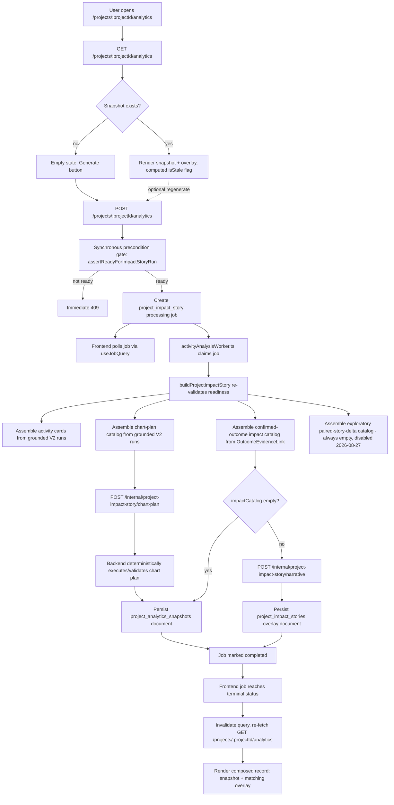

# Current Analytics Pipeline (Project Impact Story)

This is the canonical handover document for what a user sees as the
**"Analytics" project tab** — also called the **"Analysis tab"** by some
users — reachable at `/projects/$projectId/analytics` in `ia_webapp`
(route file `ia_webapp/src/routes/projects/$projectId/analytics.tsx`, tab
label locale key `projectWorkspace.tabs.analytics`). Both names point at the
same feature: **Project Impact Story**.

**This is a different feature from `ActivityAnalystV2`**, which is fully
documented in `CURRENT_ANALYSIS_PIPELINE.md`, in this same
`ia_backend/documentation/` directory. Do not confuse the two:

- `ActivityAnalystV2` is the per-activity analysis engine (deterministic
  tool execution over one activity's evidence, run from the interpretation
  page). It is documented end-to-end in `CURRENT_ANALYSIS_PIPELINE.md`.
- **Project Impact Story** (this document) is a project-level feature that
  renders a narrative and a chart plan. It consumes `ActivityAnalystV2`
  output in two distinct ways — one direct, one indirect — described in
  full below. It replaced an older "configurable analytics dashboard"
  (deleted 2026-08-18; see `CURRENT_ANALYSIS_PIPELINE.md`'s "Known Dead
  Code" section for that deletion).

## State this document was verified against

Verified by reading on-disk source directly, not by trusting either
sibling repo's own `CLAUDE.md` summary in isolation (though both `CLAUDE.md`
files corroborate the contract details below). As of this writing:

- **`ia_backend`**: every file under `src/modules/projectImpactStory/` has
  uncommitted working-tree changes (`git status` shows the whole directory
  as modified against HEAD), plus two genuinely new, untracked files:
  `projectImpactStoryChartBacklog.ts` (+ test) and
  `projectImpactStoryGoalProgress.ts` (+ test). All content below reflects
  the current working tree, not the last commit.
- **`ia_python_service`**: `app/project_impact_story/chart_plan.py`,
  `chart_plan_grounding.py`, `models.py`, `narrative.py`, and
  `narrative_grounding.py` all have uncommitted modifications. Read as
  currently on disk.
- **`ia_webapp`**: `src/components/impactStory/` has both modified files
  and several genuinely new, untracked ones (`dashboardCardChromeContext.ts`,
  `impactStoryBacklogPanel.tsx`, `projectImpactStoryGoalProgressChart.tsx`,
  `projectImpactStoryPairedDeltaGroupChart.tsx`, `sortableChartCard.tsx`,
  and — as of a later 2026-08-27/28 pass, see Stage 6 — `dashboardColumn.tsx`
  and `dashboardColumnDrag.ts`), plus `useImpactStoryDashboardLayout.ts`.
  `useMediaQuery.ts` was new at the time of the pass above but has since
  been superseded and is now dead code (Stage 6). One file is **deleted**
  in the working tree:
  `src/components/impactStory/projectImpactStoryDiagnosticsPanel.tsx`. Its
  removal, what (partially) replaced it, and what did not get replaced are
  covered in Stage 6 and "Known Dead Code" below — confirmed by reading the
  deleted file's last-committed content and grepping the current tree for
  any remaining reference to it (none found).

Updated again 2026-08-29 for a further round of uncommitted changes on top
of the above: Stage 3's fallback-localization fix and a factual correction
to which outcome-evidence-pairing files were actually deleted vs. merely
narrowed; Stage 4's new `/analytics/active-job` endpoint; Stage 5's four
additional staleness conditions tied to confirmed-link changes (see
`PAIRED_DELTA_MATCH_KEY_FIX_SUMMARY.md`); and Stage 6's real two-column
drag-and-drop rewrite (superseding the `useMediaQuery`-based masonry this
document previously described) plus a new full-page regenerating state.

## Purpose

This document is written for a senior fullstack developer who needs to:

- understand what data the Analytics tab actually reads, and from where
- understand the generation flow: what triggers it, what runs synchronously
  vs. as a background job, what Python is used for, and how grounding keeps
  LLM output honest
- understand the several distinct sub-mechanisms that decide which charts
  get shown and why (chart-plan selection, chart backlog, goal progress,
  paired-story-delta, chart-opportunity audit, chart-selection audit) —
  these are easy to conflate and each has a narrow, distinct job
- locate the key files per stage, across all three services
- know the exact registered routes and persisted Mongo collections
- know what's dead, orphaned, or partially replaced

## Executive Summary

The Analytics tab shows a project-level story assembled from two
structurally different data sources that are combined at render time but
never merged into one list:

1. **Direct, grounded consumption of `ActivityAnalystV2` output.** Every
   activity's latest _completed_ V2 run (selected by
   `projectImpactStoryV2RunSelection.ts`, matched against that activity's
   _current_ uploads so a stale run is excluded) contributes its grounded
   calculations, goal assessments, and descriptive context distributions
   into a project-wide catalog. A calculation is "grounded" only if it is
   reachable from a goal assessment whose status is not
   `requires_clarification`/`requires_capability` (see
   `projectImpactStoryGrounding.ts`). This catalog feeds the per-activity
   summary cards, the LLM chart-plan selection, the deterministic chart
   backlog, and the deterministic goal-progress chart. **No human
   confirmation is required for this path** — it is gated only by the V2
   pipeline's own grounding, the same invariant `CURRENT_ANALYSIS_PIPELINE.md`
   documents for V2 itself.
2. **Human-confirmed `OutcomeEvidenceLink` records, for the narrative
   only.** A separate, narrower "impact catalog" is built exclusively from
   `OutcomeEvidenceLink` records a human has explicitly confirmed (owned by
   a separate outcome-statements/"Wirkungsaussage" feature, documented
   elsewhere — this document only describes the consumption boundary). This
   is the _only_ catalog ever sent to the narrative-generation LLM call —
   deliberately, so the narrative can never write outcome-sounding prose
   over unconfirmed reach/process data. It also feeds one deterministic,
   always-rendered chart (paired before/after deltas).

So the sibling document's short note ("depends on `ActivityAnalystV2`
output only indirectly, through evidence a human has already linked to a
declared outcome") is accurate for the **narrative text** specifically, but
incomplete for the feature as a whole: activity cards, the chart-plan
catalog, the chart backlog, and the goal-progress chart all read
`ActivityAnalystV2` runs **directly** (gated by V2's own grounding, not by
human confirmation). Only the narrative and the confirmed-outcome catalog
require a human-confirmed link. See Stage 1 below for the precise
mechanism.

Generation is a persisted, versioned **snapshot + overlay**, not something
computed live per page view, and it already runs as an **asynchronous
background job**, following the same job-then-poll pattern
`CURRENT_ANALYSIS_PIPELINE.md` documents for `ActivityAnalystV2` and
qualitative coding review — there is no separate migration needed here.

## Service Boundaries

### `ia_webapp`

Owns:

- the Analytics tab UI: narrative banner, headline KPI row, activity
  timeline, dashboard chart grid (drag-to-reorder, hide/show), backlog
  panel
- triggering/regenerating a story
- per-viewer dashboard layout (card order/visibility), persisted to
  `localStorage`, not the backend

Key files:

- `src/routes/projects/$projectId/analytics.tsx` — thin route, renders
  `ProjectImpactStoryPage`
- `src/components/impactStory/projectImpactStoryPage.tsx` — the page's main
  component (see Stage 6)
- `src/components/impactStory/impactStoryNarrativeBanner.tsx`
- `src/components/impactStory/impactStoryHeadlineKpiRow.tsx`
- `src/components/impactStory/impactStoryActivityTimeline.tsx`
- `src/components/impactStory/impactStoryBacklogPanel.tsx` (new)
- `src/components/impactStory/sortableChartCard.tsx` (new)
- `src/components/impactStory/projectImpactStoryChart.tsx` — dispatches a
  chart spec to `projectImpactStoryBarChart.tsx` /
  `projectImpactStoryDistributionChart.tsx` / `projectImpactStoryPieChart.tsx`
  / `projectImpactStoryLineChart.tsx` by `chartType`
- `src/components/impactStory/projectImpactStoryImpactChart.tsx`,
  `projectImpactStoryGoalProgressChart.tsx` (new),
  `projectImpactStoryPairedDeltaGroupChart.tsx` (new),
  `projectImpactStoryContextChart.tsx`
- `src/hooks/useImpactStoryDashboardLayout.ts` (new) — client-side card
  order/visibility, `localStorage`-backed
- `src/hooks/useMediaQuery.ts` (new) — drives the two-column masonry split
- `src/hooks/useWorkspaceQueries.ts` — `useProjectAnalyticsQuery`,
  `useRunProjectAnalyticsMutation`, `useJobQuery`
- `src/services/apiClient.ts` — `getProjectAnalytics`/`getProjectImpactStory`,
  `runProjectAnalytics`/`runProjectImpactStory` (see "Current API Surface")
- `src/routes/projects/$projectId/activities/$activityId/analytics.tsx` — a
  thin `LegacyRedirect` route (same pattern `CURRENT_ANALYSIS_PIPELINE.md`
  documents for the old per-activity analysis routes) that forwards to the
  project-level `/projects/$projectId/analytics` page; it renders nothing
  of this feature itself

### `ia_backend`

Owns:

- MongoDB persistence for both the snapshot and the outcome-linked overlay
- authorization (project edit/view)
- assembling the project-wide catalog from `ActivityAnalystV2` runs
- assembling the confirmed-outcome impact catalog from `OutcomeEvidenceLink`
  records
- calling Python for chart-plan selection and narrative generation
- deterministic execution/validation of whatever Python proposes (same
  "Python plans, backend executes" split `CURRENT_ANALYSIS_PIPELINE.md`
  documents for V2)
- the async job (`project_impact_story`), claimed by the same
  `activityAnalysisWorker.ts` process that also claims `activity_analysis_v2`
  and `qualitative_coding_review` jobs

Key files (all under `src/modules/projectImpactStory/` unless noted):

- `projectImpactStoryRoutes.ts`, `projectImpactStoryController.ts`,
  `projectImpactStoryService.ts` — HTTP surface and orchestration
- `projectImpactStoryV2RunSelection.ts` — selects each activity's current
  (evidence-matching, completed) V2 run; see Stage 1
- `projectImpactStoryAssembly.ts` — builds per-activity summary cards from
  grounded V2 calculations
- `projectImpactStoryCatalog.ts` — builds the chart-plan candidate catalog
  from V2 runs (calculations, goal assessments, context distributions)
- `projectImpactStoryContextCatalog.ts` — deterministic fallback pool of
  descriptive distributions (used only when the chart plan selects nothing)
- `projectImpactStoryImpactCatalog.ts` — builds the confirmed-outcome
  catalog from `OutcomeEvidenceLink` records (the only catalog the
  narrative call ever sees)
- `projectImpactStoryPairedStoryDeltaCatalog.ts` — always returns an empty
  array as of 2026-08-27; see Stage 3 for why
- `projectChartOpportunityAudit.ts`, `projectChartSelectionAudit.ts` —
  deterministic, no-LLM audits of what could/did get shown (see Stage 3)
- `projectImpactStoryChartPlanExecution.ts`,
  `projectImpactStoryChartPlanFallback.ts`,
  `projectImpactStoryChartBacklog.ts` (new) — deterministic
  validation/execution of Python's chart-plan proposal, plus the emergency
  and backlog fallbacks (see Stage 3)
- `projectImpactStoryGoalProgress.ts` (new) — deterministic goal-vs-target
  progress entries (see Stage 3)
- `projectImpactStoryGrounding.ts` — the shared "is this calculation
  grounded" gate
- `projectImpactStoryCalculationDisplay.ts` — turns a raw V2 calculation
  into a displayable tile (KPI / category rank / line series), via an
  explicit tool-name allowlist
- `projectImpactStoryStaleness.ts` — computed-on-read staleness check
- `projectAnalyticsSnapshotModel.ts` / `*MongoRepository.ts` /
  `*Persistence.ts` / `*Repository.ts` — the snapshot record (see Stage 4)
- `projectImpactStoryModel.ts` / `*MongoRepository.ts` / `*Persistence.ts`
  / `*Repository.ts` — the outcome-linked narrative overlay record (see
  Stage 4)
- `projectImpactStoryTestFixtures.ts`
- `src/workers/activityAnalysisWorker.ts` — claims `project_impact_story`
  jobs (alongside `activity_analysis_v2`/`qualitative_coding_review`)
- `src/modules/processing/pythonProcessingClient.ts` —
  `generateProjectImpactStoryNarrative`, `planProjectImpactStoryChart`

### `ia_python_service`

Owns:

- the chart-plan LLM call: selects which already-computed catalog entries
  become headline KPIs / charts, and how — never computes a number itself
- the narrative LLM call: writes the project's lead narrative from the
  confirmed-outcome catalog plus a separate output-facts list — never
  invents a number
- deterministic grounding validation for both calls, and a deterministic,
  non-LLM fallback for each when grounding is exhausted

Key files (`app/project_impact_story/`):

- `chart_plan.py`, `chart_plan_grounding.py`
- `narrative.py`, `narrative_grounding.py`
- `models.py`

Both endpoints are registered in `app/api/routes.py`, in the same HTTP API
process that hosts the `ActivityAnalystV2` planner endpoint
(`CURRENT_ANALYSIS_PIPELINE.md`'s Stage 9) — not in the separate worker
process that does evidence parsing.

## End-to-End Flow

## Stage 1: Data Lineage — Two Independent Sources, Combined Only at Render

### The direct path: `ActivityAnalystV2` runs, gated by grounding only

`projectImpactStoryV2RunSelection.ts`'s `selectCurrentV2RunsByActivity`
picks, per activity, the newest **completed** `activity_analysis_runs_v2`
document whose evidence snapshot (`run.evidence[].uploadMetadataId`)
_exactly matches_ that activity's current set of uploads. An activity with
no completed run, or whose newest completed run was built from
now-superseded evidence, is excluded (`activitiesExcludedIds`) — the same
"stay on current state, not merely the newest document" invariant
`CURRENT_ANALYSIS_PIPELINE.md` documents for `currentActivityEvidenceLoader.ts`
in the V2 pipeline itself.

This one helper is reused by four different callers, each reading V2 run
data directly:

- `projectImpactStoryAssembly.ts` — builds each activity's summary card
  from `run.calculations`, filtered through
  `collectGroundedCalculationIds` (`projectImpactStoryGrounding.ts`): a
  calculation counts as displayable only if some goal assessment with
  status other than `requires_clarification`/`requires_capability`
  references it via `supportingCalculationIds`.
- `projectImpactStoryCatalog.ts` — builds the chart-plan candidate catalog:
  the same grounded calculations, plus **every** goal assessment
  regardless of status (a `requires_clarification` goal is still a real
  fact worth surfacing as a gap — it's excluded from calculation _values_,
  not from the catalog of assessable facts), plus `run.contextCatalogEntries`
  (descriptive distributions with no goal/outcome link).
- `projectImpactStoryContextCatalog.ts` — a smaller deterministic pool of
  the top-N context distributions by sample size, used only as a fallback
  when the chart plan selects nothing.
- `projectChartOpportunityAudit.ts` — the same run data, reclassified into
  a deterministic "what could have been shown" audit (see Stage 3).

**No human confirmation gates any of this.** The only gate is
`ActivityAnalystV2`'s own grounding (goal assessment status), which is
computed automatically by the V2 pipeline documented in
`CURRENT_ANALYSIS_PIPELINE.md`.

### The confirmed-outcome path: `OutcomeEvidenceLink`, for the narrative only

A second, structurally separate catalog — the **impact catalog**
(`ImpactCatalogItem[]`) — is built by
`projectImpactStoryImpactCatalog.ts`'s `buildProjectImpactStoryImpactCatalog`
exclusively from `OutcomeEvidenceLinkPersistenceRecord` documents returned
by `outcomeEvidenceLinkRepository.listByProjectId(projectId, session)` —
i.e. records a human has already confirmed via the separate outcome-
statements ("Wirkungsaussage") feature. The exact fields this feature reads
off a link, discriminated by `shape` (defined in
`ia_backend/src/shared/contracts.ts`):

- `shape: "paired_delta"` — `linkId`, `outcomeId`, `activityIdBefore`,
  `activityIdAfter`, `beforeUploadMetadataId`, `beforeTableName`,
  `beforeColumnName`, `afterUploadMetadataId`, `afterTableName`,
  `afterColumnName`, `matchKey`, `pairingGroupKey`
- `shape: "single_distribution"` — `linkId`, `outcomeId`, `activityId`,
  `uploadMetadataId`, `tableName`, `categoryColumnName`

For each link, `buildPairedDeltaEntry`/`buildSingleDistributionEntry`
re-resolve the referenced evidence through the _current_ privacy-safe
tables (`CurrentActivityEvidenceLoader`) and re-run the measurement live
via `ActivityAnalysisV2ToolExecutor` (`join_tables` + `paired_change`, or
`group_count`) — the numbers are recomputed against current data every
generation, never cached off the link itself. A link whose evidence can no
longer be resolved (e.g. re-uploaded since confirmation) is logged and
skipped, not fatal to the whole build.

**This impact catalog is the only catalog ever sent to the narrative LLM
call** (`generateProjectImpactStoryNarrative`) — deliberately, so the
narrative can never write outcome-sounding prose over reach/process data no
human has vetted. It also drives one deterministic, always-rendered chart
(`ProjectImpactStoryPairedDeltaGroupChart`, see Stage 6) and the
`otherCatalogEntries` distribution/unmeasured cards on the page — those
render straight from the impact catalog, with no LLM chart-plan selection
step involved.

### Net effect

The sibling document's summary ("depends on `ActivityAnalystV2` output only
indirectly ... through evidence a human has already linked to a declared
outcome") describes the **narrative text and the confirmed-outcome
cards** correctly, but not the **activity cards, chart-plan catalog, chart
backlog, or goal-progress chart**, all of which read grounded V2 output
directly. Both paths are real and coexist; they are combined only at
render time in `projectImpactStoryPage.tsx` (see Stage 6), never merged
into a single backend list.

## Stage 2: Assertion / Readiness Gate

### Main file

- `ia_backend/src/modules/projectImpactStory/projectImpactStoryService.ts`
  — `assertReadyForImpactStoryRun` (aliased as `assertReadyForProjectAnalyticsRun`)

### What it checks

1. `authorizationService.canEditProject` (edit access)
2. the project has at least one activity (`project_impact_story_no_activities`,
   409, if not)
3. either the V2-derived assembly produced at least one activity card, or
   the chart-plan catalog has at least one entry
   (`project_impact_story_no_grounded_indicators`, 409, if not)

This runs **twice**, deliberately, mirroring `ActivityAnalysisV2Service`'s
own two-call-site pattern documented in `CURRENT_ANALYSIS_PIPELINE.md`
(Stage 8): once synchronously in the controller before a job is even
created (so a doomed request gets an immediate 4xx), and again at the top
of `buildProjectImpactStory` inside the job body (state can drift between
enqueue and claim).

This same call also builds and returns the full catalog set (activity
cards, chart-plan catalog, context charts, impact catalog, goal-progress
entries, chart-opportunity audit) — both call sites get the same
assembly logic; only the job body goes on to actually call Python and
persist.

## Stage 3: The Chart-Selection Sub-Mechanisms

Five distinct, easy-to-conflate pieces decide _which_ charts appear and
why. Each has one narrow job. For the full mechanism-level detail on this
stage specifically — the chart-plan LLM call's exact prompt, its request/
response schema, the grounding checker, the retry/fallback behavior, and
the precise ordering of every deterministic sub-mechanism relative to that
call — see `PROJECT_IMPACT_STORY_CHART_SELECTION_GENERATION.md` (this
directory), the same way `PROJECT_IMPACT_STORY_NARRATIVE_GENERATION.md`
goes one level deeper on the narrative call in Stage 4 below.

- **`projectImpactStoryChartPlanExecution.ts`** — deterministically
  validates and executes Python's chart-plan _proposal_. Python only ever
  selects `entryId`s and an aggregation/chart-type choice; every displayed
  number and every chart datum is computed here from the same catalog
  `ia_backend` already built and sent — never trusted from the Python
  response. Enforces structural comparability (same `toolName`/`unit`/
  `denominatorType`) before allowing a cross-entry `sum`/`average`, decides
  pie-vs-distribution for context breakdowns from actual segment
  count/spread rather than trusting the LLM's chart-type pick, and drops a
  goal-assessment-by-status chart candidate if the deterministic
  goal-progress chart already covers the same ground.
- **`projectImpactStoryChartPlanFallback.ts`** — the _emergency_ fallback,
  used only when the whole Python chart-plan HTTP call throws (unavailable,
  timeout, malformed response) — distinct from Python's own internal
  grounding-exhaustion fallback (which still requires the call to have
  succeeded). Built entirely from goal-assessment catalog entries, so it
  still produces something for a project with zero numeric calculations
  (e.g. every goal is `evidence_only`). **Fixed 2026-08-27/28
  (uncommitted):** `buildDeterministicFallbackChartPlan` now takes a
  `language: "de" | "en"` param and localizes its four headline-KPI labels
  via a new `_FALLBACK_KPI_LABELS` map, instead of the previous hardcoded
  English strings — those labels could reach `OUTPUT_FACT` values quoted
  verbatim inside an otherwise-German generated narrative. The call site
  (`projectImpactStoryService.ts`) passes the project's own `language`
  through unchanged.
- **`projectImpactStoryChartBacklog.ts`** (new) — the deterministic,
  no-LLM counterpart to chart-plan selection: one ready-to-render chart per
  catalog entry the chart plan did **not** select this run, so the
  frontend's backlog panel can add any of them to the dashboard instantly.
  Only `context_distribution`, `paired_story_delta`, and `calculation`
  entries whose tile is `category_rank`/`line_series` ever produce a
  backlog chart; `goal_assessment` entries are deliberately excluded since
  they already live in the goal-progress chart when it exists.
- **`projectImpactStoryGoalProgress.ts`** (new) — a fully deterministic,
  always-computed "% of target reached" ranking over every catalog
  `goal_assessment` entry that has both a `measuredValue` and `targetValue`.
  **Never subject to chart-plan selection** — `projectImpactStoryPage.tsx`
  renders it unconditionally whenever it's non-empty.
- **`projectImpactStoryPairedStoryDeltaCatalog.ts`** — **permanently
  disabled as of 2026-08-27; always returns `[]`.** This used to be the
  _exploratory_ counterpart to the confirmed impact catalog: the same
  declared-pairing detection and `join_tables`/`paired_change` measurement,
  but run across every activity in the project (not just the two system
  activities a confirmed link is typically drawn from), excluding any pair
  already confirmed as an `OutcomeEvidenceLink`. That detection lived in
  `outcomeEvidencePairingCandidateMatcher.ts` (deleted outright by
  `OUTCOME_EVIDENCE_MERGE_PLAN.md`'s Phase 6) and a system-activity-scoped
  loader inside `outcomeEvidencePairingEvidenceLoader.ts` — that file itself
  survives (it still serves this catalog's own
  `loadProjectEvidenceTablesForStoryPairing`, an every-activity-scope
  loader, unrelated to the deleted one), but its system-activity-scoped
  export was removed along with the candidate matcher (the old two-activity
  baseline/impact_measurement split both depended on no longer exists).
  Rebuilding it against the new merged-activity model was
  explicitly out of scope for that plan and was not done — this was a
  deliberate, user-approved permanent degradation of this specific
  exploratory chart type, not a bug. The exported type
  (`ProjectImpactStoryCatalogPairedStoryDeltaEntry`) and function signature
  are kept only because historical snapshots using this shape may still
  exist and render elsewhere — every entry was always explicitly unconfirmed
  (never proof of outcome change) and rendered visually distinct
  (`ProjectImpactStoryChartSpec.isExploratory`), for whatever historical
  data is still on disk.
- **`projectChartOpportunityAudit.ts`** — a deterministic (no LLM) audit of
  every chart-worthy fact a project's current V2 runs _could_ support,
  classified as `ready_now`, `blocked_by_extraction` (a pipeline
  limitation, e.g. a deterministic tool doesn't exist yet or a column never
  resolved an `epistemicRole`), or `blocked_by_missing_data` (evidence
  exists but isn't measurable yet, or needs a clarification answer).
  Reuses `projectImpactStoryCatalog.ts`'s own `entryId` scheme so its
  entries line up 1:1 with the real catalog.
- **`projectChartSelectionAudit.ts`** — a deterministic diff between the
  opportunity audit's `ready_now` set and what the chart plan actually
  selected this run (`selectedEntryIds` from
  `projectImpactStoryChartPlanExecution.ts`). Answers "X was available —
  why didn't it show up?" Must be computed from one generation run's own
  data, never recomputed later against since-changed data.

Both audits are computed on every generation and stored inside the
snapshot's `diagnostics` field — but see Stage 6/"Known Dead Code" for what
currently renders them (answer: nothing, directly).

## Stage 4: Snapshot Generation and Persistence — Async Job, Not Live Computation

### Routes

- `POST /projects/:projectId/analytics` (and its alias
  `POST /projects/:projectId/impact-story`)
- `GET /projects/:projectId/analytics` (and its alias
  `GET /projects/:projectId/impact-story`)

Both route pairs are registered in `projectImpactStoryRoutes.ts` and both
resolve to the **same controller methods** — `triggerImpactStoryRun` calls
`triggerProjectAnalyticsRun`; `getLatestImpactStory` calls
`getLatestProjectAnalytics`. They are not two features; `/impact-story` and
`/analytics` are two URL spellings of one endpoint, kept for
frontend/backend naming-history reasons (`apiClient.ts` still exposes both
`getProjectAnalytics`/`getProjectImpactStory` and
`runProjectAnalytics`/`runProjectImpactStory`, but `projectImpactStoryPage.tsx`
only calls the `*ProjectAnalytics*` variants).

### Already an async job, not a synchronous request

`POST /projects/:projectId/analytics` does **not** run generation inline.
It:

1. runs the synchronous precondition gate (Stage 2) so a not-ready project
   gets an immediate 4xx
2. creates a `project_impact_story` processing job
   (`ProcessingJobService.create`) and returns that job record immediately
3. the frontend polls the job (`useJobQuery`) until terminal, then
   re-fetches `GET /projects/:projectId/analytics`

`activityAnalysisWorker.ts` — the same standalone backend worker process
documented in `CURRENT_ANALYSIS_PIPELINE.md` for `activity_analysis_v2`
and `qualitative_coding_review` jobs — claims `project_impact_story` jobs
too (`supportedJobTypes` in `activityAnalysisWorker.ts` lists all three) and
calls `ProjectImpactStoryService.buildProjectAnalytics`, which re-validates
readiness itself before any Python call (same enqueue/claim drift reasoning
as Stage 2). So there is no synchronous-vs-async migration question left
open for this feature the way `CURRENT_ANALYSIS_PIPELINE.md` raises for
other LLM-backed work — it already follows the established job-then-poll
pattern.

`pythonProcessingClient.ts`'s `projectImpactStoryLlmTimeoutMs` (300,000 ms)
documents why a generous budget is safe here: both the narrative and
chart-plan calls run inside this background job, and each runs its own
grounding-retry loop via the shared `run_with_grounding_retries` helper —
`chart_plan.py`'s `_MAX_GROUNDING_RETRIES = 2` (up to 3 full LLM calls);
`narrative.py`'s is intentionally lower, `_MAX_GROUNDING_RETRIES = 1` (up
to 2 full LLM calls), because that call resends the project's entire
evidence catalog as context on every attempt, making retries there more
expensive than chart-plan's (see `PROJECT_IMPACT_STORY_NARRATIVE_GENERATION.md`,
this directory, for the full narrative-call mechanics: verbatim prompt,
the deterministic grounding checker, and retry/fallback behavior) — the
generic 120s `llmTimeoutMs` had
been observed timing out a real narrative generation mid-retry-loop despite
the underlying work eventually succeeding, the same failure mode
`CURRENT_ANALYSIS_PIPELINE.md` documents for the V2 planner's own timeout
history.

### What `buildProjectImpactStory` does, in order

1. re-run `assertReadyForImpactStoryRun`
2. call `planChartsAndKpis` — `POST /internal/project-impact-story/chart-plan`,
   then deterministically execute/validate the response
   (`executeProjectImpactStoryChartPlan`); on any thrown error, fall back to
   `buildDeterministicFallbackChartPlan` and log a warning (chart-plan
   failure never blocks the rest of the story)
3. build the chart backlog (`buildProjectImpactStoryChartBacklog`) from
   whatever the chart plan didn't select
4. build the chart-selection audit from this same run's opportunity audit
   and `selectedEntryIds`
5. persist a `project_analytics_snapshots` document (status `completed`)
   with activity cards, headline KPIs, chart plan, backlog chart plan,
   context charts (fallback only, used when `chartPlan.length === 0`),
   goal-progress entries, and diagnostics (including both audits)
6. if the confirmed-outcome impact catalog is empty, return here — no
   narrative call, no overlay document, `story.narrativeSummary` stays
   `null`
7. otherwise call `generateNarrative` —
   `POST /internal/project-impact-story/narrative`; on success, persist a
   `project_impact_stories` overlay document referencing the snapshot's id
   (`analyticsSnapshotId`); on a thrown error, persist an overlay anyway,
   but with a **backend-side, non-LLM fallback narrative**
   (`buildImpactCatalogFallbackNarrativeSummary`) built field-for-field the
   same way `narrative.py`'s own `_build_deterministic_fallback_summary`
   would, `narrativeStatus: "call_failed"`, and the real error message

Every code path is logged once via a shared `logCompletion` closure, so
"what did this run actually produce" is always visible regardless of which
of the above exit points was taken.

### Why two Mongo documents, not one

The snapshot (`project_analytics_snapshots`) and the outcome-linked overlay
(`project_impact_stories`) are separate collections, joined at read time by
`analyticsSnapshotId`. A read
(`ProjectImpactStoryService.getLatestForProject`) only uses the overlay if
`overlay.analyticsSnapshotId === snapshot.id` — an overlay from a stale
prior generation is never silently attached to a newer snapshot. This
split exists because the two halves fail independently (a chart-plan
failure and a narrative failure are unrelated) and the snapshot alone is
already a complete, renderable result even with `impactCatalog.length === 0`
(step 6 above) — nothing forces a project with no confirmed outcome links
yet to wait on or fail because of the narrative stage.

## Stage 5: Staleness (Computed on Read, Never Persisted)

### Main file

- `ia_backend/src/modules/projectImpactStory/projectImpactStoryStaleness.ts`

`computeProjectImpactStoryStaleness` is called by
`getLatestForProject` on every read, never persisted as a flag (a
persisted flag would itself go stale the moment new evidence lands). A
story is stale if any of the following hold:

- the project's current activity id set differs from the snapshot's
  `sourceSnapshot` activity ids, or
- the _current_ latest-completed-V2-run id for some activity (via the same
  selection logic as Stage 1) is a different document than what the
  snapshot's `sourceSnapshot` recorded (V2 runs are append-only — a rerun
  creates a new document rather than mutating the old one), or
- **(2026-08-27/28, uncommitted, closes the paired-delta match-key bug —
  see `PAIRED_DELTA_MATCH_KEY_FIX_SUMMARY.md`)** a confirmed
  `OutcomeEvidenceLink` exists with no matching entry in the overlay's
  impact catalog, or
- the overlay's impact catalog has _more_ entries than there are current
  confirmed links (a link was removed since the overlay was generated), or
- any current confirmed link's `updatedAt` is newer than the overlay's
  generation time (a link was re-approved/changed since), or
- the overlay's impact catalog is non-empty but zero confirmed links
  currently exist (every link was removed)

The four new conditions all take the _current_ confirmed-links list and
the _current_ overlay as explicit new parameters
(`computeProjectImpactStoryStaleness`,
`projectImpactStoryStaleness.ts:36-39`) rather than only the snapshot —
staleness now reacts to confirmed-link changes, not just to new V2 runs or
activity-set changes. See `PAIRED_DELTA_MATCH_KEY_FIX_SUMMARY.md` (item D)
for why this was necessary: before this fix, editing or removing a
confirmed link left the narrative/impact catalog silently unchanged until
some unrelated V2 rerun happened to also mark the story stale.

`isStale` is returned alongside the story on every `GET`; the frontend
shows it as a banner cue with a regenerate action (Stage 6), not as a
blocking state.

## Stage 6: Frontend Rendering

### Main file

- `ia_webapp/src/components/impactStory/projectImpactStoryPage.tsx`

### What it renders, and in what order

`ProjectImpactStoryPage` fetches the composed record via
`useProjectAnalyticsQuery` and renders, top to bottom:

1. `ImpactStoryActivityTimeline` — always
2. `ImpactStoryNarrativeBanner` (with regenerate control) — shown above the
   chart grid only when `story.impactCatalog.length > 0`
   (`hasOutcomeOverlay`); otherwise it renders **below** the grid instead,
   so a project with no confirmed outcomes yet still gets the regenerate
   control without an empty narrative banner dominating the top of the page
3. `ImpactStoryBacklogPanel` — the never-selected chart-plan candidates
   plus anything a viewer has manually hidden (see below)
4. `ImpactStoryHeadlineKpiRow`
5. **(2026-08-27/28, uncommitted — replaces the mechanism previously
   described here)** the dashboard chart grid — a genuine two-column,
   drag-and-drop-reorderable, per-card-hideable layout, built from, **in
   this fixed default order**:
   - the goal-progress chart (if `goalProgressEntries.length > 0`) —
     "did it work," tier one
   - the paired-delta group chart (if any confirmed `paired_delta` impact
     catalog entries exist) — "did it work," tier two
   - one `ProjectImpactStoryImpactChart` per remaining (non-`paired_delta`)
     impact catalog entry (`single_distribution`/`unmeasured`)
   - the LLM-selected `chartPlan` entries — reach/process/context, weaker
     evidentiary weight, deliberately placed _after_ the two "did it work"
     tiers per the code's own comment
   - the context-chart fallback pool, only if `chartPlan.length === 0`

The dashboard's default order is deliberately evidentiary-strength-first
(target-vs-achieved and confirmed outcome measurement lead; the LLM-curated
reach/process story follows), but a viewer can drag any card to override
it — see `useImpactStoryDashboardLayout.ts`.

**New as of 2026-08-27/28 (uncommitted):** while any `project_impact_story`
job is in flight — a first-time run or a regenerate — the entire dashboard
above (banner, KPIs, charts, everything) is replaced by a new full-page
`ImpactStoryRegeneratingState` (`impactStoryEmptyState.tsx`), rendered from
`projectImpactStoryPage.tsx` ahead of the empty-state branch whenever
`isRegenerating` is true. This replaces the previous pattern of a merely
disabled regenerate button sitting above unchanged, increasingly-stale
content — `impactStoryNarrativeBanner.tsx`'s `isRegenerating` prop was
removed entirely; the banner now only ever renders while idle.

### Per-viewer layout persistence — client-side, not backend state

`useImpactStoryDashboardLayout` persists layout to `localStorage`, keyed
per project (`impactStory.dashboardLayout.${projectId}`) — **not** to any
backend field. This is intentional: a regenerate reassembles the chart plan
from scratch and the LLM's own `chartId` strings aren't guaranteed stable
run to run, so a saved layout is inherently "how this browser wants to view
the current chart set," not a durable cross-device project setting. Hiding
a dashboard card and adding a backlog card are the same operation in
opposite directions over one saved `hidden` id list.

**2026-08-27/28 correction (uncommitted) — the persisted shape and drag
mechanism changed.** An earlier version of this section described a single
`{order: string[], hidden: string[]}` shape with columns derived at render
time via `useMediaQuery("(min-width: 1024px)")` splitting `visibleIds` by
even/odd index. `useMediaQuery.ts` still exists as a file but
`projectImpactStoryPage.tsx` no longer imports it and there are no other
call sites — it is now dead code. The persisted shape is now
`{columns: ColumnPair, hidden: string[]}` (`ColumnPair = [string[],
string[]]`, `useImpactStoryDashboardLayout.ts`), with real column
membership stored explicitly rather than derived from a single order list.
Two new files implement genuine cross-column drag via `@dnd-kit`:
`dashboardColumn.tsx` (the droppable column component, with a sentinel
droppable id for an empty column) and `dashboardColumnDrag.ts` — the
mechanics (`moveCardOverColumn` live-previews a card moving between columns
during `onDragOver`; `reorderWithinColumn` finalizes same-column reordering
on drop). A new `appendBalanced` helper places any newly-appearing or
unhidden card into whichever column currently has fewer cards, so the two
columns don't drift lopsided as the chart set changes across regenerations.

### No diagnostics panel

`src/components/impactStory/projectImpactStoryDiagnosticsPanel.tsx` is
deleted in the current working tree (confirmed via `git status` and by
reading its last-committed content) and no remaining file references it
(confirmed by grep). It was a read-only accordion rendering
`chartOpportunityAudit`/`chartSelectionAudit` — the two deterministic
audits from Stage 3, which are still computed and still persisted inside
`project_analytics_snapshots.diagnostics` on every generation.

Unlike the parallel deletion `CURRENT_ANALYSIS_PIPELINE.md` documents for
`ActivityAnalystV2`'s own diagnostics panel (dropped with **no**
replacement), this one has a **partial, deliberate replacement**:
`impactStoryBacklogPanel.tsx` carries an explicit comment — "Replaces the
old read-only chart-opportunity diagnostics panel: instead of just listing
which ready charts weren't selected this run, every backlog card here is
actionable — click one to add it to the dashboard." So the "what's
available but not on the dashboard" question is answered again, but through
a different, actionable UI, using `chartBacklogPlan`
(`projectImpactStoryChartBacklog.ts`, Stage 3), not through the raw
audit data.

What did **not** carry forward: the audit's own `status`/`reasonCode`/
`reasonDetail` fields (e.g. `blocked_by_extraction` vs.
`blocked_by_missing_data`, or the selection-audit's `selectionWarnings`)
are not rendered anywhere in `ia_webapp` as of this writing — confirmed by
grep across `src/components/impactStory/`. The only surviving surface of
`ProjectImpactStoryDiagnostics` is `activitiesWithNoGroundedIndicators`,
read directly by `impactStoryNarrativeBanner.tsx` to flag activities with
no chartable evidence yet. `chartOpportunityAudit`/`chartSelectionAudit`
are computed, persisted, and currently write-only from the frontend's
perspective — confirm this is intentional (a reviewer-only backend
diagnostic, perhaps intended for a future admin surface) before assuming
it's a gap to fill.

## Data Stores and Collections

### Collections used by this feature

- `project_analytics_snapshots` — the primary generated-story record
  (`projectAnalyticsSnapshotModel.ts`). Holds `status`, `sourceSnapshot`,
  `activityCards`, `headlineKpis`, `chartPlan`, `backlogChartPlan`,
  `contextCharts`, `goalProgressEntries`, `diagnostics` (including both
  chart audits), `llmUsage`, `errorMessage`. Indexed on `{ projectId: 1,
createdAt: -1 }`.
- `project_impact_stories` — the confirmed-outcome narrative overlay
  (`projectImpactStoryModel.ts`), keyed to a snapshot via
  `analyticsSnapshotId`. Holds `status`, `impactCatalog`,
  `narrativeSummary`, `narrativeStatus`, `llmUsage`, `errorMessage`.
  Indexed on `{ projectId: 1, createdAt: -1 }`.

### Upstream collections this feature reads but does not own

- `activity_analysis_runs_v2` — read directly (see Stage 1); owned and
  documented by `CURRENT_ANALYSIS_PIPELINE.md`
- the `OutcomeEvidenceLink` collection — read via
  `outcomeEvidenceLinkRepository.listByProjectId`; owned by the separate
  outcome-statements feature, not documented here
- `activities`, `uploads` — read for context (activity names, current
  upload sets)

### Canonical read for the Analytics tab

`GET /projects/:projectId/analytics` composes and returns the **latest**
snapshot joined with its matching overlay (if any) — never a merge across
multiple snapshots, and never an overlay from a superseded snapshot (see
Stage 4's "why two documents" note).

## Important Architectural Decisions

### 1. Two catalogs, two trust levels, never merged

The grounded-V2-run catalog (no human confirmation required, gated by V2's
own grounding) and the confirmed-outcome catalog (human-confirmed
`OutcomeEvidenceLink` only) stay structurally separate end to end. Only the
confirmed catalog ever reaches the narrative LLM call. This is what
prevents the narrative from writing outcome-sounding sentences over
reach/process data nobody has vetted as real outcome evidence — the same
problem class `CURRENT_ANALYSIS_PIPELINE.md`'s epistemic-role gate solves
for V2's own tool execution, applied here at the project-narrative layer
instead.

### 2. Python plans, backend executes — same split as V2

Neither the chart-plan nor the narrative Python call computes or invents a
number. The chart-plan response schema carries no `value` field at all,
only `entryId` references; the narrative response carries free text, but
every number-like token in it is checked against the real values on the
catalog entries it cites (`narrative_grounding.py`'s
`_NUMBER_TOKEN_PATTERN` extraction plus per-shape candidate-string
matching), with a deterministic non-LLM fallback on grounding exhaustion.

### 3. Snapshot + overlay is a persisted, versioned artifact, not a live view

Regenerating creates new documents; reading never recomputes. Staleness is
a computed-on-read signal, not a mutation of old data.

### 4. Already async — no migration debt here

Unlike some other LLM-backed work `CURRENT_ANALYSIS_PIPELINE.md` flags as a
future direction, this feature already uses the job-then-poll pattern from
day one of its current form: `POST` creates a `project_impact_story` job
and returns immediately, the frontend polls, `activityAnalysisWorker.ts`
does the real work.

### 5. Every "why wasn't this shown" question has a deterministic answer, even if unsurfaced

`projectChartOpportunityAudit.ts`/`projectChartSelectionAudit.ts` exist
specifically so "X was available — why didn't it show up?" always has a
computed, non-speculative answer tied to the exact generation run that
produced it. That the frontend currently only partially surfaces this data
(Stage 6) is a UI completeness question, not a data-availability one.

## Current API Surface

### Canonical project analytics API

- `POST /projects/:projectId/analytics` (alias:
  `POST /projects/:projectId/impact-story`) — runs the synchronous
  readiness gate, then creates a `project_impact_story` processing job and
  returns the job record. Poll the job, then read via the route below.
- `GET /projects/:projectId/analytics` (alias:
  `GET /projects/:projectId/impact-story`) — returns
  `{ story: ProjectImpactStoryRecord | null, isStale: boolean }`, the
  latest snapshot composed with its matching overlay (or `story: null` if
  no snapshot exists yet)
- `GET /projects/:projectId/analytics/active-job` (new, 2026-08-27/28
  uncommitted) — `ProjectImpactStoryController.getActiveProjectAnalyticsRun`
  (`projectImpactStoryController.ts`) returns any currently in-flight
  `project_impact_story` job for the project, or `null`. Lets the frontend
  discover a run already started from a different tab/session on mount,
  rather than only ever knowing about a run it itself just triggered — see
  `ia_webapp`'s `useActiveProjectAnalyticsJobQuery`, consumed by
  `projectImpactStoryPage.tsx`'s resume-on-mount effect. Pairs with the
  create-or-return-existing-job dedup logic in `triggerProjectAnalyticsRun`
  (already documented above, Stage 4/§2) — that dedup is not new, only this
  read-only discovery endpoint is.

Both alias pairs resolve to the same controller methods (see Stage 4) —
not two independent surfaces to keep in sync.

### Generic processing-job API (same contract documented in `CURRENT_ANALYSIS_PIPELINE.md`)

- `GET /jobs/:processingJobId`, `POST /jobs/:processingJobId/sync`,
  `POST /jobs/:processingJobId/cancel`, `GET /activities/:activityId/jobs`
  — `project_impact_story` is a third `jobType` value flowing through the
  same `ai_executions`/`ProcessingJobService` contract as
  `activity_analysis_v2` and `qualitative_coding_review`.

### Internal Python API this feature calls

- `POST /internal/project-impact-story/chart-plan` — request:
  `{projectId, projectName, language, catalog: [...], allowedChartTypes,
headlineKpiCount}`; response:
  `{headlineKpis, chartPlan, groundingStatus, fellBackToDeterministicSelection,
llmUsage}`
- `POST /internal/project-impact-story/narrative` — request:
  `{projectId, projectName, language, projectPeriod, targetGroup, region,
initialSituation, outputFacts, catalog}`; response:
  `{narrativeSummary, groundingStatus, groundingRetryCount,
fellBackToDeterministicSummary, llmUsage}`

Full field-level shapes are documented in `ia_python_service/CLAUDE.md`
under "Where job processing actually happens" — kept there rather than
duplicated here since that file is the one place both services' owners are
expected to check when the contract changes.

### Upstream prerequisite APIs

- at least one project activity with a completed, current-evidence-matching
  `ActivityAnalystV2` run (for the grounded-catalog path), **or**
- at least one human-confirmed `OutcomeEvidenceLink` (for the
  confirmed-outcome path) — either alone is enough to pass the readiness
  gate in Stage 2, since the gate only requires _some_ chartable material
  from either source

## Guidance for Future Work

### Safe direction

- keep the two catalogs (grounded-V2, confirmed-outcome) structurally
  separate; never let the narrative call see the grounded-V2 catalog
  directly
- keep new chart-selection logic deterministic and backend-owned; Python
  should keep proposing selections, never computing values
- if the reviewer-diagnostics gap (chart-opportunity/chart-selection audit
  data computed but unrendered — see Stage 6) turns out to matter in
  practice, the data is already there in `project_analytics_snapshots.diagnostics`;
  it would need a new frontend surface (an admin/reviewer view, not
  necessarily the deleted panel's exact shape), not new backend work
- continue treating `activity_analysis_runs_v2` as read-only from this
  feature's perspective — it never writes back to that collection

### Unsafe direction

- letting the narrative LLM call see ungrounded or unconfirmed evidence
  directly
- merging the grounded-V2 catalog and the confirmed-outcome catalog into
  one list — they carry different trust guarantees and existing code
  (narrative grounding, the page's `hasOutcomeOverlay` split) depends on
  them staying separate
- treating `/analytics` and `/impact-story` as independently evolvable
  routes — they are the same controller methods today; changing one
  without the other will silently desync the aliases
- persisting per-viewer dashboard layout to the backend without checking
  `useImpactStoryDashboardLayout.ts`'s stated reasoning first (chart ids
  aren't stable across regenerations, so a naive backend-persisted layout
  would silently lose or misapply saved positions)

### Open considerations (not scoped, not committed)

- **Reviewer-diagnostics surface.** `chartOpportunityAudit`/
  `chartSelectionAudit` are fully computed and persisted but have had no
  frontend consumer since `projectImpactStoryDiagnosticsPanel.tsx` was
  deleted. Whether that data still matters as a reviewer-facing surface, or
  whether `impactStoryBacklogPanel.tsx`'s actionable replacement already
  covers the practical need, hasn't been decided in code — flagged here
  rather than assumed either way.

## Document Status

This file is the canonical handover document for the Project Impact
Story feature (the Analytics/Analysis tab). It does not track
`ActivityAnalystV2` itself — see `CURRENT_ANALYSIS_PIPELINE.md`, in this
same `ia_backend/documentation/` directory, for that pipeline, and update
this file (not a new Markdown file) if this feature's architecture shifts.
